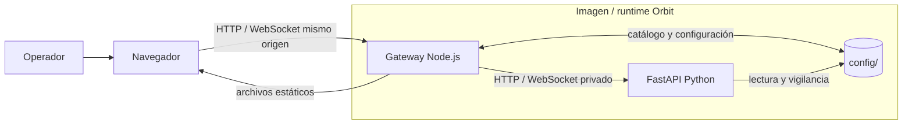
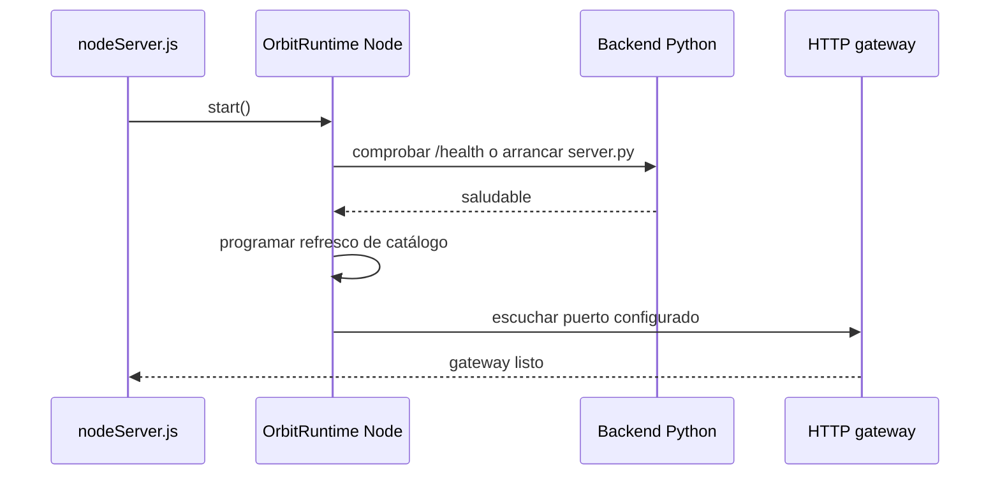
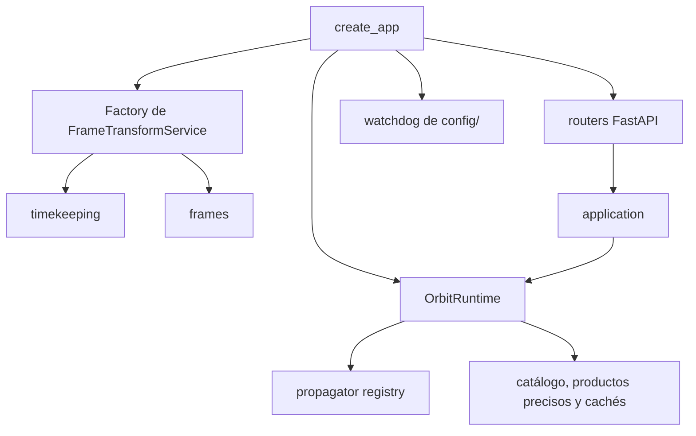
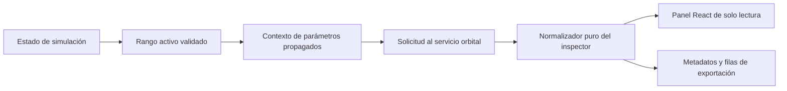

# Arquitectura

## Propósito

Orbit separa la interfaz de visualización, la persistencia y el cálculo
orbital en procesos y módulos con responsabilidades distintas. El diseño evita
que el navegador acceda directamente a los archivos de catálogo o al proceso
Python, y evita que los propagadores necesiten conocer la estructura de la
interfaz.

## Dominios de ejecución

| Dominio | Ubicación principal | Responsabilidad | No es responsable de |
| --- | --- | --- | --- |
| Interfaz React | `react-ui/` | Composición de la aplicación, paneles, diálogos y build Vite. | Servir HTTP, persistir catálogo o calcular propagación. |
| Runtime Cesium heredado | `front/` | Visor, assets y módulos que siguen en la migración incremental. | Convertirse en una segunda API de backend. |
| Gateway | `server/` | Servir archivos, persistir configuración, importar/refrescar catálogo y proxy HTTP/WebSocket. | Implementar los algoritmos orbitales. |
| Backend orbital | `server/python/orbit_api/` | Propagación, efemérides, marcos, tiempo, formatos, visibilidad, productos GNSS precisos y rutas FastAPI. | Exponerse directamente como API pública por defecto. |
| Datos persistentes | `config/` | Configuración de sistema, catálogo y fuentes/manifest de productos precisos locales montados en Docker. | Autenticación, multitenencia o base de datos remota. |
| Operación local | `.scripts/` | Reinicio, estado, logs y ejecución de pruebas en Windows. | Una CLI de producto versionada. |

## Composición del runtime

`server/nodeServer.js` construye `OrbitRuntime` y arranca sus servicios en este
orden:

El runtime Node reutiliza un backend Python ya saludable en la URL configurada
o intenta iniciar `server.py` como proceso hijo. Si un hijo propiedad del
runtime termina de forma inesperada, el gestor programa recuperación con
retardos crecientes de 1, 2 y 5 segundos. La parada del runtime cierra primero
las tareas del gateway y después el proceso Python que él mismo inició.

## Gateway Node.js

`createOrbitRuntime` compone repositorios de configuración y catálogo,
importación, refresco remoto, cliente Python, supervisor Python y aplicación
Express. Sus límites principales son:

1. **Configuración.** `system_config.json` se lee y escribe mediante un
   repositorio; la escritura usa una operación atómica. El payload público se
   sanea antes de persistirse y no puede cambiar el archivo de catálogo activo
   durante la ejecución.
2. **Catálogo.** El gateway importa, normaliza, refresca y exporta entradas.
   Las rutas de catálogo no atraviesan FastAPI.
3. **Proxy.** Las rutas orbitales permitidas se reenvían al origen Python con
   un tiempo máximo de 30 segundos. Los fallos de conexión se convierten en
   `502` JSON.
4. **WebSocket.** Sólo `/ws` se actualiza hacia el backend. El gateway conserva
   los sockets y handshakes para cerrarlos en una parada ordenada.
5. **Estáticos.** Sirve la distribución generada de React, el runtime Cesium y
   los assets de `front/`.

Las rutas expuestas y sus contratos están en [REST API](../integrations/rest-api.md)
y [WebSocket](../integrations/websocket.md).

## Backend Python

La raíz de composición es `orbit_api.bootstrap.create_app()`.

| Módulo | Responsabilidad |
| --- | --- |
| `api/routes/` | Adaptadores HTTP y WebSocket; no contienen la lógica numérica principal. |
| `application/` | Casos de uso de runtime, órbitas manuales, productos GNSS SP3 con auxiliares, parámetros orbitales y exportadores. |
| `domain/requests.py` | Modelos Pydantic y normalización de solicitudes. |
| `orbits/propagators/` | Contratos y motores SGP4, dos cuerpos, Cowell/RK4 y rutas heredadas. |
| `frames/` | `StateVector`, identificadores de marco, transformaciones y realizaciones terrestres. |
| `timekeeping/` | Escalas temporales, tablas de segundos intercalares y proveedores EOP C04 locales. |
| `formats/` | Lectores tabulares SP3, CLK, ERP y OEM con metadatos de marco/tiempo. |
| `ground_stations/` | Elevación y extracción muestreada de ventanas AOS/LOS. |
| `infrastructure/` | Caché TTL/LRU y observador del directorio de configuración. |

El ciclo de vida FastAPI carga la constelación, incluidos los productos GNSS
verificados bajo `config/precise-products/`, y activa un observador no
recursivo de `config/`. El observador solicita una recarga cuando cambia la
configuración del sistema o el archivo de catálogo configurado.

## Contratos numéricos

`StateVector` es el contrato cartesiano compartido. Obliga a declarar época,
escala temporal, marco, realización cuando aplique, centro, posición y, si
está disponible, velocidad, aceleración, covarianza y procedencia.

| Aspecto | Regla |
| --- | --- |
| Unidades internas | SI: m, m/s y m/s². Los adaptadores de propagadores convierten desde km y km/s. |
| Marcos | TEME, EME2000, GCRF, ICRF, CIRS, TIRS, PEF e ITRF; `ECI` y `ECEF` genéricos se rechazan. |
| TLE/SGP4 | Estado nativo TEME. |
| Propagación manual de dos cuerpos/Cowell | Estado nativo EME2000. |
| Transformación terrestre | Rutas explícitas TEME→PEF→ITRF y GCRF/ICRF/EME2000→CIRS→TIRS→ITRF. |
| Tiempo | UTC, TAI, TT, UT1, GPS, GAL, QZS, BDT y GLO se manejan de forma explícita según los datos necesarios. |

La factory de marcos carga datos locales de tiempo y EOP al iniciar. Un
`FrameTransformService` recibe su tabla de segundos intercalares, de modo que
dos servicios no comparten accidentalmente una tabla configurada para el otro.
En modo estricto se exige un snapshot EOP C04 local identificado y una tabla
local de segundos intercalares que cubra el intervalo requerido.

## Inspector de efemérides

El inspector de efemérides es un límite de presentación entre el runtime de
escena y el resultado de propagación. El runtime sigue siendo dueño del reloj,
la selección de capa, la solicitud HTTP, la cancelación y la política de
marcos/tiempo; React no deriva una órbita alternativa a partir de lo que pinta.

El rango activo existe únicamente en modo `range` y con `end > start`. Se
publica como `simulationRange` y el inspector lo observa por una clave de
dominio (modo, inicio y fin), no por el *tick* del cursor. Por ello mover el
playhead no relanza una propagación, mientras que cambiar de modo o límites
sustituye una solicitud pendiente. El diseño manual conserva su ventana de
*epochs* como excepción explícita y no muta el reloj compartido.

El normalizador recibe hechos del backend y del contexto y publica un contrato
de presentación `inspector`: perfil de fuente, disponibilidad, método, marco,
calidad, fuerzas, precisión, columnas cartesianas y filas. El subcontrato de
marco separa `native`, `current` (salida real de la tabla), `output` (solicitud
y procedencia de transformación) y `calculation` (marco de elementos), además
de las opciones que el servicio puede intentar validar. El selector React envía
solo un `outputFrame` concreto o lo omite para **Nativo**; nunca cambia el
reloj/rango global ni relabela una respuesta previa. Las capas de
presentación deben conservar un dato ausente como ausente; no pueden inferir un
TLE desde un vector, SGP4 desde OEM/SP3, ni una realización terrestre desde una
etiqueta ECI/ECEF genérica. Las columnas derivadas requieren entradas finitas y
deben quedar diferenciadas de los componentes cartesianos originales.

La exportación se construye a partir del mismo contrato normalizado y recibe un
*snapshot* `exportMetadata` con perfil, disponibilidad, marco, método, `range`,
`simulationRange`, columnas, `scope` y `presentation.timeFilter`/
`presentation.sort`. Los filtros son predicados locales sobre las filas ya
normalizadas: no cambian la solicitud, la simulación ni la procedencia. Este
límite evita que una exportación parcial pierda la explicación de cómo se
obtuvo cada estado.

Las pruebas de contrato cubren el rango activo de solo lectura, perfiles
TLE/SP3/OEM/OMM/vector/numeric/manual, columnas comunes y derivadas, la
precisión `++` de SP3, la asociación exacta CLK, el marco de salida/transformación
por fila y el acoplamiento entre filtro y metadatos de exportación. La especificación para
operadores está en [Inspector de efemérides](../user-guide/ephemerides.md).

## Datos, caché y coherencia

| Recurso | Política actual |
| --- | --- |
| Caché de órbitas de WebSocket | TTL de 10 s; la clave incorpora configuración, selección y token de datos EOP/tiempo. |
| Caché de efemérides | LRU de hasta 256 elementos y TTL de 120 s. |
| Límite de serie de efemérides | 20 000 puntos. |
| Muestras de órbita de API | Hasta 7200 si se solicitan explícitamente. |
| Carga de datos temporales | Local al arranque; las transformaciones no descargan productos EOP o leap seconds. |

Un cambio de catálogo o configuración invalida las cachés runtime relevantes al
recargar la constelación. No hay persistencia de caché entre reinicios.

## Extensibilidad y límites

La separación de módulos permite añadir un formato, un propagador o una
transformación sin acoplarlo a la interfaz, pero no equivale a una API pública
de plugins. No hay SDK Python distribuido, CLI de producto, plugins instalables
ni extensiones backend de terceros. Consulte [Plugins](../integrations/plugins.md).

Tampoco hay autenticación, autorización, gestión de usuarios, base de datos
remota ni colaboración multiusuario. Cualquier despliegue expuesto debe añadir
esas protecciones fuera de Orbit.

## Prácticas de cambio

1. Mantener los modelos de solicitud en `domain/` y los adaptadores HTTP en
   `api/routes/`.
2. Mantener las conversiones de marco y tiempo en `frames/` y `timekeeping/`;
   no ocultarlas en serializadores o componentes de UI.
3. Añadir una identidad de datos a las claves de caché si una salida depende de
   un nuevo producto de referencia.
4. Conservar rutas y campos de compatibilidad sólo cuando su semántica física
   siga siendo inequívoca.
5. Añadir pruebas del contrato y actualizar la documentación afectada.

## Referencias relacionadas

- [Testing](testing.md)
- [Validación](validation.md)
- [Despliegue](deployment.md)
- [Bibliografía](../reference/bibliography.md)
