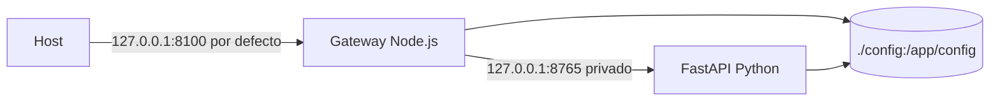

# Despliegue

## Modelo soportado

Orbit se empaqueta como una imagen Docker única y se arranca mediante Docker
Compose con el servicio `orbit`. La imagen contiene Node.js, un entorno virtual
Python, el gateway, el backend FastAPI, la distribución React y los assets de
runtime. El gateway escucha dentro del contenedor en el puerto `8100` y el
backend Python permanece en `127.0.0.1:8765` dentro del mismo runtime.



No se incluyen manifiestos Kubernetes, Helm chart, imagen publicada, despliegue
cloud gestionado ni arquitectura multiinstancia. No deben presentarse como
opciones soportadas por el proyecto actual.

## Inicio con Compose

```bash
docker compose up --build
```

Para segundo plano:

```bash
docker compose up -d --build
docker compose ps
```

El contenedor declara un healthcheck HTTP contra `http://127.0.0.1:8100/health`.
Compose aplica `restart: unless-stopped`. La imagen ejecuta Node como proceso
principal; Node supervisa el backend Python privado.

## Documentación integrada

La imagen construye el mismo sitio MkDocs que se publica en GitHub Pages y lo
sirve en `/Orbit/`. El botón `?` de la aplicación lo muestra dentro del
espacio de trabajo; también puede abrirse directamente en una pestaña. La ruta
`/docs` permanece reservada para la interfaz Swagger del backend FastAPI.

## Exposición de red

| Variable | Predeterminado | Efecto |
| --- | --- | --- |
| `ORBIT_HTTP_BIND` | `127.0.0.1` | Dirección de publicación en el host. Sólo admite `127.0.0.1` u `0.0.0.0` en los scripts Windows. |
| `ORBIT_HTTP_PORT` | `8100` | Puerto publicado del host. Debe ser un entero entre 1 y 65535 en los scripts Windows. |
| `PORT` | `8100` | Puerto interno del gateway en el contenedor. |
| `PYTHON_BACKEND_URL` | `http://127.0.0.1:8765` | Origen privado que utiliza el gateway para FastAPI. |

`ORBIT_HTTP_BIND=0.0.0.0` publica Orbit en todas las interfaces del host. No
hay autenticación ni autorización en la aplicación; use firewall, VPN o proxy
inverso con controles de acceso antes de utilizar esa opción fuera de una red
de confianza.

## Persistencia

Compose monta `./config` del host en `/app/config`. El volumen conserva el
catálogo, la configuración y `precise-products/` cuando se recrea el
contenedor. La imagen contiene una copia inicial de `config/`, pero el montaje
la reemplaza al arrancar con Compose.

No hay migración de base de datos, almacenamiento remoto de proyectos, backup
automático, cifrado de datos en reposo ni restauración integrada. El operador
es responsable de respaldar `config/` y de comprobar su contenido antes de
actualizar una instancia.

## Datos de tiempo y orientación terrestre

Los datos EOP y de segundos intercalares se configuran con variables de entorno
y deben referirse a rutas válidas dentro del contenedor, normalmente bajo el
volumen `/app/config`.

| Grupo | Variables |
| --- | --- |
| Snapshot C04 | `ORBIT_EOP_C04_PATH`, `ORBIT_EOP_C04_SHA256`, `ORBIT_EOP_C04_REQUIRE_SHA256`, `ORBIT_EOP_SOURCE`, `ORBIT_EOP_VERSION`, `ORBIT_EOP_QUALITY`. |
| Política EOP | `ORBIT_EOP_STRICT`, `ORBIT_EOP_ALLOW_EXTRAPOLATION`, `ORBIT_EOP_REQUIRED_START`, `ORBIT_EOP_REQUIRED_END`. |
| Leap seconds | `ORBIT_LEAP_SECONDS_PATH`, `ORBIT_LEAP_SECONDS_SHA256`, `ORBIT_LEAP_SECONDS_SOURCE`, `ORBIT_LEAP_SECONDS_VERSION`, `ORBIT_LEAP_SECONDS_REQUIRED`, `ORBIT_LEAP_SECONDS_REQUIRE_UNEXPIRED`. |
| Realización terrestre | `ORBIT_TERRESTRIAL_REALIZATION`, `ORBIT_ENABLE_IGS20_FAMILY_ITRF2020_ALIGNMENT` (familia IGS20/IGb20/IGc20) o la variable histórica exacta `ORBIT_ENABLE_IGS20_ITRF2020_ALIGNMENT`; no active ambas. |

En modo estricto, Orbit exige un C04 local, hash cuando la política lo requiere
y una tabla local de segundos intercalares vigente. La carga se realiza al
arranque; las transformaciones no descargan datos de referencia durante una
solicitud. Consulte [Tiempo, EOP e ITRF](../operations/time-eop.md) para el
procedimiento operativo de estos ficheros.

## Operación Windows

| Script | Efecto |
| --- | --- |
| `.\.scripts\restart-orbit.cmd` | Construye con caché, detiene Compose, recrea el servicio y espera hasta 90 s el healthcheck. |
| `.\.scripts\restart-orbit.cmd -SkipBuild` | Reutiliza la imagen actual y reinicia. |
| `.\.scripts\restart-orbit.cmd -NoCache` | Construye sin caché antes de reiniciar. |
| `.\.scripts\orbit-status.cmd` | Muestra `docker compose ps`. |
| `.\.scripts\orbit-logs.cmd` | Sigue los logs de Compose. |

Un reinicio reconstruye la imagen salvo que se use `-SkipBuild`; no borra el
volumen montado `config/`. La semántica de reinicio de Docker no debe confundirse
con una operación de recuperación de datos.

## Desarrollo sin Docker

El repositorio permite iniciar el gateway de forma local después de instalar
dependencias, compilar React y disponer de Python:

```bash
py -3 -m pip install -r server/requirements.txt
npm ci --prefix react-ui
npm run build --prefix react-ui
npm ci --prefix server
npm run start --prefix server
```

En macOS/Linux se usa normalmente `python3` y `npm` en lugar de `py -3` y
`npm.cmd`. Esta ruta no reemplaza el empaquetado Docker para operación
reproducible.

## Observabilidad y recuperación

- `GET /health` informa la disponibilidad del gateway y del backend Python.
- `docker compose logs -f orbit` muestra los logs del proceso Node y el prefijo
  de salida del backend Python hijo.
- El gateway intenta recuperar un backend Python propio que falle
  inesperadamente; no supervisa un backend externo de forma administrativa.
- No hay métricas, tracing distribuido, agregación de logs, alertas ni SLO
  declarados en el repositorio.

## Referencias relacionadas

- [Arquitectura](architecture.md)
- [Testing](testing.md)
- [REST API](../integrations/rest-api.md)
- [Apéndice de tiempo y EOP](../reference/appendix.md)
