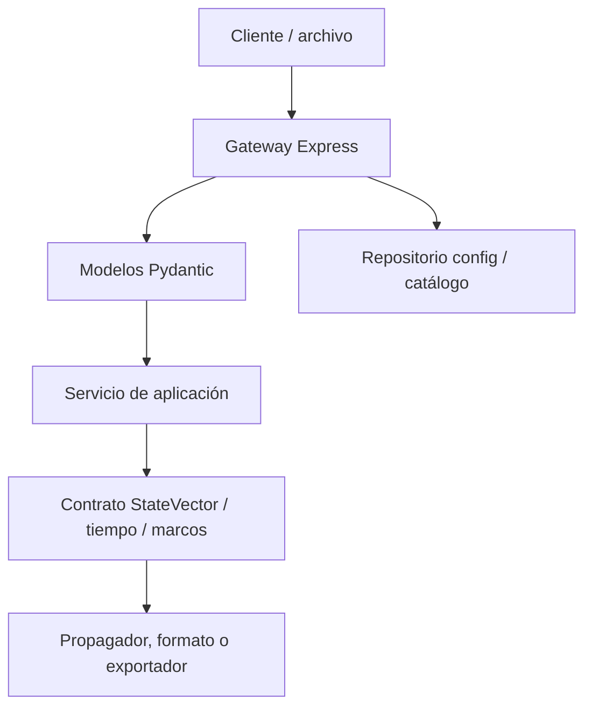

# Validación

## Propósito

Orbit valida la forma de las solicitudes, los límites de recursos, los
contratos de archivos y la identidad física de estados y datos de referencia.
La validación evita entradas ambiguas o incompatibles con la implementación;
no convierte un modelo simplificado en un producto de precisión certificada.

## Capas de validación

| Capa | Controles comprobables |
| --- | --- |
| Gateway | JSON con límite de 25 MB; errores de sintaxis `400`, tamaño `413`; sanitización de configuración y nombres de archivo de catálogo. |
| Catálogo | Parser, normalización y filtrado de TLE válidos; los OEM sin TLE embebido no se convierten en órbitas nativas de catálogo. |
| Pydantic | Tipos, campos obligatorios, rangos, fechas, definición única de fuente TLE/catálogo y opciones de órbita manual. |
| Aplicación | Intervalos crecientes, presupuesto de muestreo/integración, resolución de propagador y errores de dominio convertidos en HTTP accionable. |
| Estado orbital | Época con zona horaria, escala temporal reconocida, centro, vectores finitos, unidades y marco explícito. |
| Marcos/tiempo | Rechazo de `ECI`/`ECEF` ambiguos, tablas EOP/leap seconds, cobertura y política estricta cuando se configura. |
| Formatos tabulares | Metadatos obligatorios de segmento OEM/SP3, unidades, escala temporal, marco y restricciones de interpolación/covarianza. |

## Solicitudes HTTP

Las rutas FastAPI usan modelos Pydantic. Un cuerpo con estructura inválida suele
devolver `422`; una entrada con semántica no permitida también se convierte en
`422` en las rutas que lo controlan. El gateway conserva las respuestas del
backend cuando el proxy tiene éxito.

Ejemplos de reglas:

| Dominio | Reglas |
| --- | --- |
| Fuente TLE | Debe llegar `sat_id` o las dos líneas `line1` y `line2`. |
| Efeméride | `end_time` debe ser posterior a `start_time`; `step_seconds` es > 0 y ≤ 3600. |
| Órbita de API | `horizon_hours` está entre 0.1 y 8760; `samples`, si se suministra, entre 2 y 7200. |
| Estación | Latitud −90…90°, longitud −180…180°, elevación mínima 0…90°. |
| AOS/LOS manual | `source.kind: manual` requiere `manualOrbit` y no admite `sat_id` ni líneas TLE; la ventana de acceso sigue usando `start_time < end_time` en UTC. |
| Parámetros orbitales | 2…2000 muestras; los modelos RK4 se rechazan si exceden su presupuesto interno de pasos. |
| Órbita manual | Requiere elementos keplerianos o vector de estado; las opciones de fuerzas se normalizan al motor elegido. |

Las formas canónicas y los alias de compatibilidad se describen en
[REST API](../integrations/rest-api.md) y en OpenAPI de la instancia.

## Validación de configuración y archivos

La configuración pública requiere un objeto `system`. El archivo de catálogo
activo no puede cambiarse desde esa ruta mientras el runtime está en ejecución.
Los nombres de catálogo se normalizan para impedir escapes del directorio
`config/`, nombres reservados y caracteres no portables.

La importación de catálogo informa entradas inválidas y no crea un catálogo
vacío cuando no obtiene elementos TLE válidos. Una importación que se persiste
pero no consigue recargar el backend devuelve un resultado explícito `503` con
`persisted: true`.

## Validación de marcos y tiempo

`StateVector` no acepta etiquetas genéricas `ECI` o `ECEF`. Un consumidor debe
declarar un marco como TEME, EME2000, GCRF/ICRF, CIRS, TIRS, PEF o ITRF, y la
realización terrestre cuando corresponda. Los vectores deben tener tres
componentes numéricos finitos; la covarianza, si se suministra, es una matriz
6×6 finita.

La factory de marcos admite un modo visual aproximado sin productos locales,
pero el modo EOP estricto aplica los controles siguientes:

| Control | Comportamiento |
| --- | --- |
| C04 local | `ORBIT_EOP_C04_PATH` es obligatorio. |
| Hash | Se exige si se activa la política correspondiente o modo estricto. |
| Calidad | Modo estricto admite únicamente `final` o `rapid`. |
| Extrapolación | Se rechaza en modo estricto. |
| Leap seconds | Se exige una tabla local y vigente en modo estricto. |
| Cobertura operativa | Los límites `ORBIT_EOP_REQUIRED_START/END` deben cubrirse por C04 y tabla UTC–TAI. |
| Época solicitada | Una transformación estricta fuera de cobertura o tras la caducidad de la tabla se rechaza. |

La validación de la realización IGS20→ITRF2020 es explícita y opcional. No
infiera correcciones de estación o antena a partir de la transformación global.

## Formatos OEM y SP3

Los proveedores tabulares validan que haya metadatos de marco y escala
temporal. Un OEM requiere segmentos delimitados por `META_START`/`META_STOP` y
un `REF_FRAME` conocido. Las covarianzas OEM sólo se aceptan para bloques
cartesianos; las representaciones RTN/RSW/TNW se rechazan. La interpolación
Hermite requiere un grado impar y datos de posición/velocidad apropiados.

La existencia de estos lectores Python no publica automáticamente una ruta de
UI o REST para cargar OEM/SP3 de alta fidelidad.

## Límites de significado

- Un TLE válido no garantiza que sea apropiado para cualquier época o análisis
  de precisión.
- La validación de marcos evita ambigüedad de etiqueta, no suplanta una
  calibración geodésica o de estación.
- AOS/LOS se extrae de muestras; validar el paso no la convierte en una
  búsqueda de eventos por raíces.
- Una configuración sintácticamente válida puede apuntar a datos operativos
  insuficientes para la fidelidad que necesita una misión.

## Pruebas asociadas

La validación se cubre principalmente en `server/tests/node/` y
`server/python/tests/`, con conjuntos específicos para solicitudes, rutas,
marcos, tiempo, formatos y configuración. Consulte [Testing](testing.md) para
los comandos reproducibles.

## Referencias relacionadas

- [Arquitectura](architecture.md)
- [REST API](../integrations/rest-api.md)
- [Glosario](../reference/glossary.md)
- [Bibliografía](../reference/bibliography.md)
