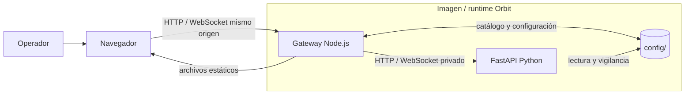
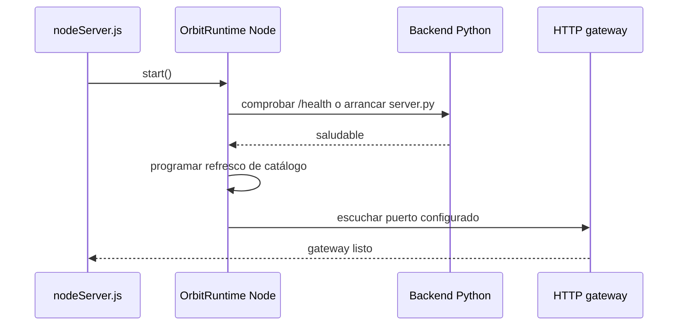
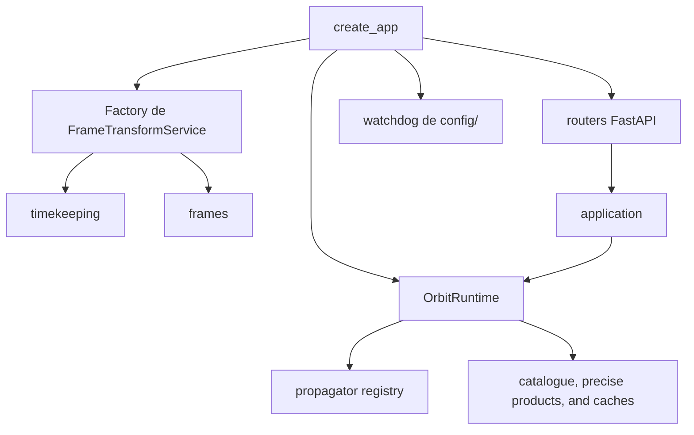
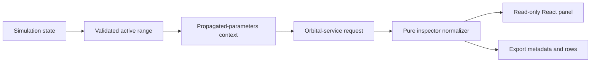

# Architecture

## Purpose

Orbit separates display interface, persistence and computation
orbital into processes and modules with different responsibilities. The design avoids
allow the browser to directly access the catalog files or the process
Python, and avoids propagators needing to know the structure of the
interface.

## Execution domains

| Domain | Main location | Responsibility | Not responsible for |
| --- | --- | --- | --- |
| React interface | `react-ui/` | Application composition, panels, dialogs and Vite build. | Serve HTTP, persist catalog or compute propagation. |
| Legacy Cesium Runtime | `front/` | Viewer, assets and modules that continue in the incremental migration. | Become a second backend API. |
| Gateway | `server/` | Serve files, persist configuration, import/refresh catalog and HTTP/WebSocket proxy. | Implement orbital algorithms. |
| Orbital Backend | `server/python/orbit_api/` | Propagation, ephemeris, frames, time, formats, visibility, precise GNSS products, and FastAPI routes. | Expose itself directly as a public API by default. |
| Persistent data | `config/` | System configuration, catalogue, and mounted local precise-product sources/manifests. | Authentication, multi-tenancy, or a remote database. |
| Local operation | `.scripts/` | Restart, status, logs and test execution in Windows. | A versioned product CLI. |

## Runtime composition

`server/nodeServer.js` builds `OrbitRuntime` and starts its services on it
order:

The Node runtime reuses an already healthy Python backend in the configured URL
or try to start `server.py` as a child process. If a child owned by
runtime terminates unexpectedly, the manager schedules recovery with
increasing delays of 1, 2 and 5 seconds. Runtime stop closes first
the gateway tasks and then the Python process that it started.

## Node.js Gateway

`createOrbitRuntime` composes configuration and catalog repositories,
import, remote refresh, Python client, Python supervisor and application
Express. Its main limits are:

1. **Configuration.** `system_config.json` is read and written using a
   repository; writing uses an atomic operation. The public payload is
   sanitizes before being persisted and cannot change the active catalog file
   during execution.
2. **Catalog.** The gateway imports, normalizes, refreshes and exports entries.
   Catalog paths do not traverse FastAPI.
3. **Proxy.** Allowed orbital paths are forwarded to the Python source with
   a maximum time of 30 seconds. Connection failures become
   `502` JSON.
4. **WebSocket.** Only `/ws` is updated to the backend. The gateway keeps
   sockets and handshakes to close them in an orderly stop.
5. **Static.** Serves the generated React distribution, the Cesium runtime and
   `front/` assets.

The exposed routes and their contracts are in [REST API](../integrations/rest-api.md)
and [WebSocket](../integrations/websocket.md).

## Python Backend

The composition root is `orbit_api.bootstrap.create_app()`.

| Module | Responsibility |
| --- | --- |
| `api/routes/` | HTTP and WebSocket adapters; they do not contain the main numerical logic. |
| `application/` | Runtime use cases, manual orbits, precise GNSS SP3 products with ancillary data, orbital parameters, and exporters. |
| `domain/requests.py` | Pydantic models and request normalization. |
| `orbits/propagators/` | SGP4 contracts and engines, two bodies, Cowell/RK4 and legacy routes. |
| `frames/` | `StateVector`, frame identifiers, transformations and ground realizations. |
| `timekeeping/` | Time scales, leap second tables, and local EOP C04 providers. |
| `formats/` | SP3, CLK, ERP, and OEM tabular readers with frame/time metadata. |
| `ground_stations/` | Sampled elevation and extraction of AOS/LOS windows. |
| `infrastructure/` | TTL/LRU cache and configuration directory watcher. |

The FastAPI lifecycle loads the constellation, including verified GNSS
products under `config/precise-products/`, and activates a non-recursive
`config/` observer. The observer requests a reload when system configuration
or the configured catalogue file changes.

## Numeric contracts

`StateVector` is the shared Cartesian contract. Forces to declare time,
time scale, frame, realization when applicable, center, position and, if
is available, velocity, acceleration, covariance and provenance.

| Appearance | Rule |
| --- | --- |
| Internal units | SI: m, m/s and m/s². Propagator adapters convert from km and km/s. |
| Marks | TEME, EME2000, GCRF, ICRF, CIRS, TIRS, PEF and ITRF; Generic `ECI` and `ECEF` are rejected. |
| TLE/SGP4 | TEME native state. |
| Manual two-body propagation/Cowell | EME2000 native state. |
| Earth transformation | Explicit routes TEME→PEF→ITRF and GCRF/ICRF/EME2000→CIRS→TIRS→ITRF. |
| Weather | UTC, TAI, TT, UT1, GPS, GAL, QZS, BDT and GLO are handled explicitly depending on the data needed. |

The frame factory loads local time and EOP data on startup. A
`FrameTransformService` receives its leap second table, so
Two services don't accidentally share a table configured for each other.
In strict mode, an identified local EOP C04 snapshot and a table are required.
local leap seconds that covers the required interval.

## Ephemerides inspector

The ephemerides inspector is a presentation boundary between the scene runtime
and a propagation result. The runtime remains the owner of the clock, layer
selection, HTTP request, cancellation, and frame/time policy; React does not
derive an alternative orbit from what it renders.

An active range exists only in `range` mode with `end > start`. It is published
as `simulationRange`, and the inspector observes a domain key (mode, start,
end), not playhead ticks. Moving the playhead therefore does not restart
propagation, whereas mode or boundary changes replace a pending request. Manual
design retains its epoch window as an explicit exception and never mutates the
shared clock.

The normalizer receives backend and context facts and publishes an `inspector`
presentation contract: source profile, availability, method, frame, quality,
forces, precision, Cartesian columns, and rows. The frame sub-contract separates
`native`, `current` (the table's actual output), `output` (requested frame and
transform provenance), and `calculation` (element frame), together with the
options the service can attempt to validate. React sends only a concrete
`outputFrame` or omits it for **Native**; it never changes the global clock/range
or relabels a prior response. Presentation must preserve an
absent fact as absent; it cannot infer TLE from a vector, SGP4 from OEM/SP3, or
an Earth realization from generic ECI/ECEF. Derived columns require finite
inputs and stay distinct from original Cartesian components.

Export is built from the same normalized contract and receives an
`exportMetadata` snapshot with profile, availability, frame, method, `range`,
`simulationRange`, columns, `scope`, and `presentation.timeFilter`/
`presentation.sort`. Filters are local predicates over normalized rows: they do
not change the request, simulation, or provenance. This boundary prevents a
partial export from losing the explanation of how its states were obtained.

Contract tests cover the read-only active range, TLE/SP3/OEM/OMM/vector/numeric/manual
profiles, common and derived columns, SP3 `++` accuracy, exact CLK association,
output-frame/per-row transformation provenance, and the filter/export-metadata coupling.
The operator specification is [Ephemerides inspector](../user-guide/ephemerides.md).

## Data, cache and coherence

| Resource | Current policy |
| --- | --- |
| WebSocket Orbit Cache | 10s TTL; The key incorporates configuration, selection and EOP/time data token. |
| Ephemeris cache | LRU of up to 256 elements and TTL of 120 s. |
| Ephemeris series limit | 20,000 points. |
| API Orbit Samples | Up to 7200 if explicitly requested. |
| Temporary data loading | Local at boot; transformations do not download EOP or leap seconds products. |

A catalog or configuration change invalidates the runtime caches relevant to the
recharge the constellation. There is no cache persistence between reboots.

## Extensibility and limits

The separation of modules allows adding a format, a propagator or a
transformation without coupling it to the interface, but it is not equivalent to a public API
of plugins. No distributed Python SDK, product CLI, installable plugins
nor third-party backend extensions. See [Plugins](../integrations/plugins.md).

There is also no authentication, authorization, user management, database
remote or multi-user collaboration. Any exposed deployment must add
those protections outside of Orbit.

## Change practices

1. Keep the request models in `domain/` and the HTTP adapters in
   `api/routes/`.
2. Maintain frame and time conversions in `frames/` and `timekeeping/`;
   Don't hide them in serializers or UI components.
3. Add a data identity to the cache keys if an output depends on
   a new reference product.
4. Preserve paths and compatibility fields only when their physical semantics
   remains unequivocal.
5. Add evidence of the contract and update the affected documentation.

## Related references

- [Testing](testing.md)
- [Validation](validation.md)
- [Deployment](deployment.md)
- [Bibliography](../reference/bibliography.md)
