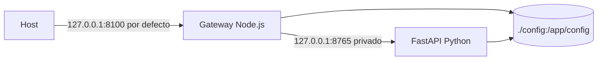

# Deployment

## Supported model

Orbit is packaged as a single Docker image and booted using Docker
Compose with the `orbit` service. The image contains Node.js, a virtual environment
Python, gateway, FastAPI backend, React distribution, and assets
runtime. The gateway listens inside the container on port `8100` and the
Python backend remains in `127.0.0.1:8765` within the same runtime.



Kubernetes manifests, Helm chart, published image, deployment are not included
managed cloud or multi-instance architecture. They should not be presented as
options supported by the current project.

## Start with Compose

```bash
docker compose up --build
```

For background:

```bash
docker compose up -d --build
docker compose ps
```

The container declares an HTTP healthcheck against `http://127.0.0.1:8100/health`.
Compose applies `restart: unless-stopped`. The image runs Node as a process
main; Node monitors the private Python backend.

## Embedded documentation

The image builds the same MkDocs site published on GitHub Pages and serves it
at `/Orbit/`. The application's `?` button displays it inside the workspace,
and it can also be opened directly in a browser tab. The `/docs` route remains
reserved for the FastAPI backend Swagger interface.

## Network Exposure

| Variable | Default | Effect |
| --- | --- | --- |
| `ORBIT_HTTP_BIND` | `127.0.0.1` | Publishing address on the host. Only `127.0.0.1` or `0.0.0.0` is supported in Windows scripts. |
| `ORBIT_HTTP_PORT` | `8100` | Published port of the host. Must be an integer between 1 and 65535 in Windows scripts. |
| `PORT` | `8100` | Internal port of the gateway in the container. |
| `PYTHON_BACKEND_URL` | `http://127.0.0.1:8765` | Private origin that uses the gateway for FastAPI. |

`ORBIT_HTTP_BIND=0.0.0.0` publishes Orbit to all host interfaces. No
there is no authentication or authorization in the application; use firewall, VPN or proxy
reverse with access controls before using that option outside of a network
trustworthy.

## Persistence

Compose mounts the host's `./config` to `/app/config`. The volume preserves
the catalogue, configuration, and `precise-products/` when the container is
recreated. The image contains an initial copy of `config/`, but the mount
replaces it when booting with Compose.

No database migration, remote project storage, backup
automatic, data encryption at rest, or built-in restore. The operator
You are responsible for supporting `config/` and checking its contents before
update an instance.

## Time and Earth Orientation Data

EOP and leap second data are configured with environment variables
and must refer to valid paths within the container, usually under the
volume `/app/config`.

| Group | Variables |
| --- | --- |
| Snapshot C04 | `ORBIT_EOP_C04_PATH`, `ORBIT_EOP_C04_SHA256`, `ORBIT_EOP_C04_REQUIRE_SHA256`, `ORBIT_EOP_SOURCE`, `ORBIT_EOP_VERSION`, `ORBIT_EOP_QUALITY`. |
| EOP Policy | `ORBIT_EOP_STRICT`, `ORBIT_EOP_ALLOW_EXTRAPOLATION`, `ORBIT_EOP_REQUIRED_START`, `ORBIT_EOP_REQUIRED_END`. |
| Leap seconds | `ORBIT_LEAP_SECONDS_PATH`, `ORBIT_LEAP_SECONDS_SHA256`, `ORBIT_LEAP_SECONDS_SOURCE`, `ORBIT_LEAP_SECONDS_VERSION`, `ORBIT_LEAP_SECONDS_REQUIRED`, `ORBIT_LEAP_SECONDS_REQUIRE_UNEXPIRED`. |
| Terrestrial realization | `ORBIT_TERRESTRIAL_REALIZATION`, `ORBIT_ENABLE_IGS20_FAMILY_ITRF2020_ALIGNMENT` (the IGS20/IGb20/IGc20 family) or the legacy exact `ORBIT_ENABLE_IGS20_ITRF2020_ALIGNMENT` variable; do not enable both. |

In strict mode, Orbit enforces a local C04 hash when policy requires it
and a current local leap second table. Charging is done at
boot; transformations do not download reference data during a
request. See [Time, EOP and ITRF](../operations/time-eop.md) for the
operating procedure for these files.

## Windows Operation

| Script | Effect |
| --- | --- |
| `.\.scripts\restart-orbit.cmd` | Build with cache, stop Compose, recreate the service and wait up to 90s for the healthcheck. |
| `.\.scripts\restart-orbit.cmd -SkipBuild` | Reuse the current image and reboot. |
| `.\.scripts\restart-orbit.cmd -NoCache` | Build without cache before reboot. |
| `.\.scripts\orbit-status.cmd` | Shows `docker compose ps`. |
| `.\.scripts\orbit-logs.cmd` | Follow the Compose logs. |

A reboot rebuilds the image unless `-SkipBuild` is used; does not delete the
mounted volume `config/`. Docker restart semantics should not be confused
with a data recovery operation.

## Development without Docker

The repository allows you to start the gateway locally after installing
dependencies, compile React and have Python:

```bash
py -3 -m pip install -r server/requirements.txt
npm ci --prefix react-ui
npm run build --prefix react-ui
npm ci --prefix server
npm run start --prefix server
```

On macOS/Linux, `python3` and `npm` are normally used instead of `py -3` and
`npm.cmd`. This route does not replace Docker packaging for operation
reproducible.

## Observability and recovery

- `GET /health` reports the availability of the Python gateway and backend.
- `docker compose logs -f orbit` shows the logs of the Node process and the prefix
  output from the child Python backend.
- The gateway tries to recover its own failed Python backend
  unexpectedly; does not administratively monitor an external backend.
- There are no metrics, distributed tracing, log aggregation, alerts or SLOs
  declared in the repository.

## Related references

- [Architecture](architecture.md)
- [Testing](testing.md)
- [REST API](../integrations/rest-api.md)
- [Time and EOP appendix](../reference/appendix.md)
