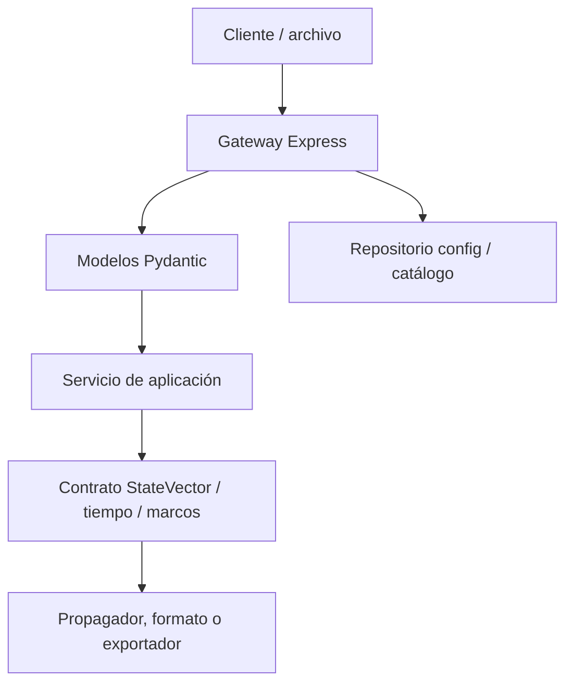

# Validation

## Purpose

Orbit validates the form of requests, resource limits,
file contracts and the physical identity of states and reference data.
Validation prevents ambiguous or implementation-incompatible input;
it does not turn a simplified model into a certified precision product.

## Validation layers

| Layer | Verifiable controls |
| --- | --- |
| Gateway | JSON with a 25 MB limit; SP3/CLK import uses its isolated 90 MB route; syntax errors `400`, size `413`; configuration sanitization and catalogue file names. |
| Catalog | Parser, normalization and filtering of valid TLEs; OEMs without embedded TLE do not become native catalog orbits. |
| Pydantic | Types, required fields, ranges, dates, single TLE/catalog source definition and manual orbit options. |
| Application | Increasing intervals, sampling/integration budget, propagator resolution and domain errors converted into actionable HTTP. |
| Orbital status | Epoch with time zone, recognized time scale, center, finite vectors, units and explicit frame. |
| Frames/time | Rejecting ambiguous `ECI`/`ECEF`, EOP/leap seconds tables, coverage and strict policy when configured. |
| Tabular formats | Required OEM/SP3 segment metadata, units, timescale, frame, and interpolation/covariance restrictions. |

## HTTP Requests

FastAPI routes use Pydantic models. A body with an invalid structure usually
return `422`; an entry with disallowed semantics also becomes
`422` in the routes that control it. The gateway retains the responses of the
backend when the proxy is successful.

Examples of rules:

| Domain | Rules |
| --- | --- |
| TLE Source | `sat_id` or the two lines `line1` and `line2` must arrive. |
| Anniversary | `end_time` must be later than `start_time`; `step_seconds` is > 0 and ≤ 3600. |
| API Orbit | `horizon_hours` is between 0.1 and 8760; `samples`, if supplied, between 2 and 7200. |
| Station | Latitude −90…90°, longitude −180…180°, minimum elevation 0…90°. |
| Manual AOS/LOS | `source.kind: manual` requires `manualOrbit` and cannot include `sat_id` or TLE lines; the access window still uses UTC `start_time < end_time`. |
| Orbital parameters | 2…2000 samples; RK4 models are rejected if they exceed their internal step budget. |
| Manual orbit | Requires Keplerian elements or state vector; Force options are normalized to the chosen engine. |
| Precise GNSS product | One to eight base64 files; one logical SP3 and optional CLK, normalized provider/class, and upload/file/expansion limits. |

Canonical forms and compatibility aliases are described in
[REST API](../integrations/rest-api.md) and in the OpenAPI of the instance.

## Configuration and file validation

Public configuration requires an `system` object. The catalog file
active cannot be changed from that path while the runtime is running.
Catalog names are normalized to prevent directory escapes
`config/`, reserved names and non-portable characters.

Catalog import reports invalid entries and does not create a catalog
empty when not getting valid TLE elements. An import that is persisted
but fails to reload the backend returns an explicit result `503` with
`persisted: true`.

## Frame and time validation

`StateVector` does not accept generic `ECI` or `ECEF` tags. A consumer must
declare a framework such as TEME, EME2000, GCRF/ICRF, CIRS, TIRS, PEF or ITRF, and the
terrestrial implementation when applicable. The vectors must have three
finite numerical components; the covariance, if supplied, is a matrix
6×6 finite.

The framework factory supports a rough visual mode without local products,
but strict EOP mode applies the following controls:

| Control | Behavior |
| --- | --- |
| local C04 | `ORBIT_EOP_C04_PATH` is required. |
| Hash | Required if the corresponding policy or strict mode is activated. |
| Quality | Strict mode supports only `final` or `rapid`. |
| Extrapolation | It is strictly rejected. |
| Leap seconds | A local and strictly valid table is required. |
| Operational coverage | `ORBIT_EOP_REQUIRED_START/END` limits must be covered by C04 and UTC–TAI table. |
| Requested period | A strict transformation out of coverage or after table expiration is rejected. |

The validation of the IGS20→ITRF2020 performance is explicit and optional. No
infer station or antenna corrections from the global transformation.

## OEM and SP3 formats

Tabular providers validate that frame and scale metadata is present
temporary. An OEM requires segments delimited by `META_START`/`META_STOP` and
a known `REF_FRAME`. OEM covariances are only accepted for blocks
cartesians; RTN/RSW/TNW representations are rejected. The interpolation
Hermite requires an odd degree and appropriate position/velocity data.

OEM remains a local-viewer route, not an operational runtime provider. SP3 is
published through `POST /api/precise-products/import`, with optional CLK,
compressed-file validation, manifest, checksums, and rehydration. That
availability does not make the importer a remote download or guarantee an
analysis centre's high-fidelity interpolation. See [Precise GNSS
products](../formats/precise-products.md).

## Limits of meaning

- A valid TLE does not guarantee that it is appropriate for any epoch or analysis
  precision.
- Frame validation avoids label ambiguity, it does not supplant a
  geodetic or station calibration.
- AOS/LOS is extracted from samples; validating the step does not make it a
  search for events by roots.
- A syntactically valid configuration can point to operational data
  insufficient for the fidelity that a mission needs.

## Associated tests

Validation is mainly covered in `server/tests/node/` and
`server/python/tests/`, with specific sets for requests, routes,
frames, time, formats and settings. See [Testing](testing.md) for
reproducible commands.

## Related references

- [Architecture](architecture.md)
- [REST API](../integrations/rest-api.md)
- [Glossary](../reference/glossary.md)
- [Bibliography](../reference/bibliography.md)
