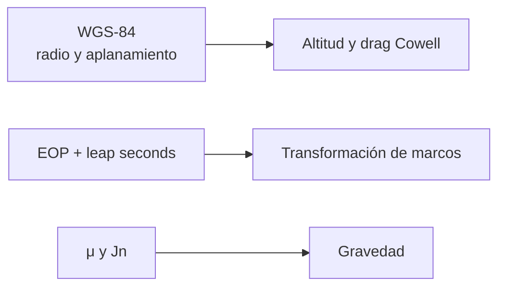

# Earth models

[Home](../index.md) · [Engineering](index.md) · [Gravity Models](gravity-models.md) · [Temporal Systems](time-systems.md)

## Ground components used

Orbit does not concentrate the Earth in a single model. Each subsystem uses a
limited and explicit contract.

| Component | Implemented usage | Data or constants |
| --- | --- | --- |
| Gravitational parameter | Classic elements, two bodies and Cowell. | \(\mu=398600.4418\ \mathrm{km^3/s^2}\). |
| Equatorial radius | Validation of perigee, zonal gravity and drag geometry. | \(R_e=6378.137\ \mathrm{km}\). |
| Ellipsoid WGS-84 | Geometric altitude of the drag model. | \(1/298.257223563\) flattening. |
| Earth rotation | Relative velocity of the atmosphere and historical adapters. | \(\omega=7.2921150\times10^{-5}\ \mathrm{rad/s}\). |
| Terrestrial orientation | Frame reduction. | EOP IERS C04 configurable: DUT1, \(x_p\), \(y_p\), \(dX\), \(dY\), LOD. |

## Orientation vs. figure

The WGS-84 form used by Cowell is a geometry approximation for
altitude. The ground orientation for passing between frames is calculated by the
frame service with EOP and, if `pyerfa` is installed, the IAU path
2006/2000A. They are different responsibilities.

## Accuracy Policy

Without a local EOP configuration, the runtime allows a visual approximation
UTC≈UT1 and marked as `approximate` in the provenance. The strict mode
requires EOP final or rapid and a local leap second table
identified; If `pyerfa` is not available, strict mode rejects the
reduction rather than silently degrading it.

## Not included

- Geoidal model, DEM, terrain, oceans, solid tides, loads or station displacements.
- Complete gravitational field, potential tides or planetary orientation models outside the Earth.
- High fidelity meteorological, solar or geomagnetic atmosphere.

See [Reference frames](reference-frames.md),
[Gravity models](gravity-models.md) and
[Atmospheric model](atmospheric-models.md).