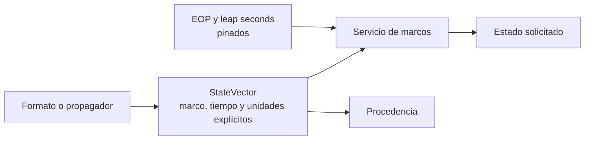

# Orbital engineering

[Home](../index.md) · [Propagation](../propagation/index.md) · [Formats](../formats/index.md)

This section defines Orbit number contracts. The pages describe the
behavior implemented by the Python service; do not convert tags
of interface in claims of scientific fidelity.

## Contract map

| Theme | Documented contract |
| --- | --- |
| [Cartesian states](cartesian-states.md) | `StateVector`, SI units, velocity, acceleration, covariance and provenance. |
| [Orbital representations](orbit-representations.md) | Representations that Orbit accepts or retains. |
| [Keplerian elements](keplerian-elements.md) | Elliptical mean elements of manual orbits. |
| [Equinox elements](equinoctial-elements.md) | Support status: not available. |
| [Reference frames](reference-frames.md) | Supported frameworks, transformation paths and land realizations. |
| [Temporary systems](time-systems.md) | Scales, leap seconds and EOP. |
| [Coordinate systems](coordinate-systems.md) | Scope of coordinates and spatial conventions. |
| [Earth Models](earth-models.md) | Constants and land products used by the runtime. |
| [Gravity models](gravity-models.md) | Central gravity and zonal harmonics available. |
| [Atmospheric model](atmospheric-models.md) | First order exponential atmosphere for Cowell. |

!!! warning "Rule of interpretation"

    A vector does not acquire a frame, a realization, or a time scale by
    the context of the view. If an origin does not declare them sufficiently,
    Orbit rejects the transformation or keeps the original label.

## Relationship with other subsystems

Tabulated readers and propagators are described in
[Formats](../formats/index.md) and [Propagation](../propagation/index.md).