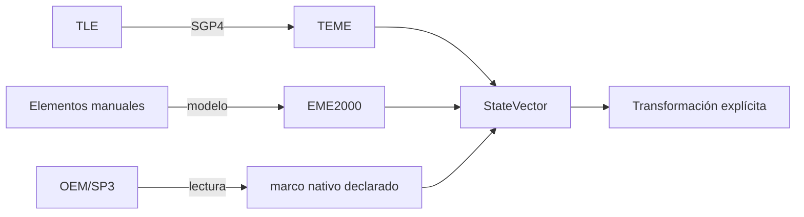

# Orbital representations

[Home](../index.md) · [Engineering](index.md) · [Cartesian states](cartesian-states.md) · [Keplerian elements](keplerian-elements.md)

## Scope

Orbit separates the representation of a state from its dynamic source. A TLE,
some Keplerian elements and an OEM/SP3 ephemeris can end up in a
`StateVector`, but they are not interchangeable nor do they retain the same semantics.

| Representation | State | Implemented usage | Frame/time that should not be inferred |
| --- | --- | --- | --- |
| Cartesian state | Available | Common contract for all suppliers. | Always explicit in the state. |
| Middle Keplerian elements | Available | Entry of manual two-body and J2 orbits. | They are interpreted in `EME2000` with UTC epoch of the manual model. |
| TLE | Available | Catalog and SGP4. | The native SGP4 state is `TEME`. |
| OEM/SP3 tabulated | Python reader available | Native samples and bounded interpolation. | The file declares it by segment/series. |
| Equinox elements | Not available | There is no input, converter or exporter. | Not applicable. |
| OPM/OCM as a complete physical state | Not available | It is not used as a source of propagation. | Not applicable. |

## Conservation rule

A supplier delivers to its native state first. Converting to a framework
Consumption is requested later and is recorded at the source.

The architecture avoids converting a source state to a generic label
before knowing what reduction or realization is required.

## Representation vs. model

A representation does not determine the force model:

- TLE involves the use of SGP4 in the Orbit catalog.
- Manual elements can feed two bodies or the analytical model
  J2 compatibility; There is also an SGP4 route through synthetic TLE.
- Cowell requires a manual Cartesian state in `EME2000`, not a conversion
  automatically from any representation.
- OEM and SP3 are tabulated sources; your reader interpolates within the coverage,
  It does not integrate equations of motion.

See [Propagation](../propagation/overview.md) and
[Formats](../formats/overview.md) for the contract of each source.

## Conversion limits

Orbit does not publish a general conversion between all representations. In
In particular, it does not implement equinoctial elements, hyperbolic states or
manual parabolic tests, conversion of covariances to elements and determination of
orbit from observations.