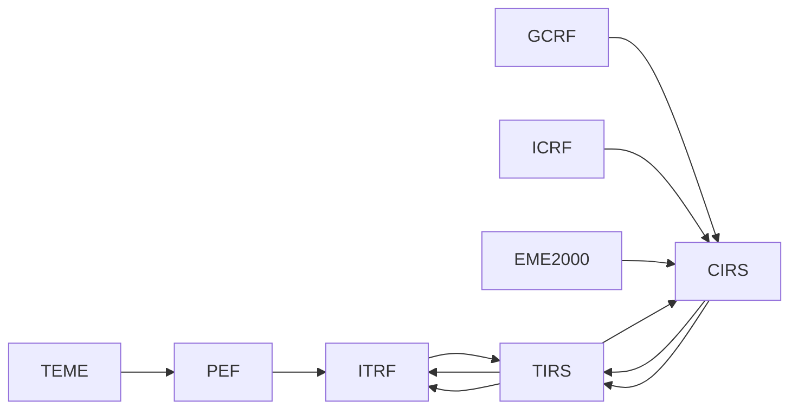

# Reference frames

[Home](../index.md) · [Engineering](index.md) · [Cartesian States](cartesian-states.md) · [Temporal Systems](time-systems.md)

## Purpose

`FrameTransformService` separates the production of a native state from the view
in the requested framework. Does not rename vectors to satisfy the consumer:
calculates a compatible route or returns an error.

Built-in transformations are geocentric and require `center = EARTH`.
States retain their original time scale; UTC is obtained internally
only for reduction with EOP and leap seconds.

## Supported Frameworks

| Family | Identifiers | Treatment |
| --- | --- | --- |
| SGP4 | `TEME` | Classic TEME → PEF → ITRF route using GMST82 and polar movement. |
| Celestial inertials | `GCRF`, `ICRF`, `EME2000` | IAU celestial-terrestrial route 2006/2000A when `pyerfa` is available. |
| Intermediates | `CIRS`, `TIRS`, `PEF` | Explicit connection with Earth's rotation and polar movement. |
| Terrestrial | `ITRF` | Departure or transit frame; its realization can be declared. |
| External terrestrial | `IGS*`, `WGS84`, `PZ90` | They are retained as origin and require a recorded completion operation. |

`J2000` and `EME2K` are aliases for `EME2000`; `ITRS` is an alias for `ITRF`. The
Generic tags `ECI` and `ECEF` are rejected.

## Manual-orbit and catalogue frames

Choosing a propagator does not authorize renaming its frame. Orbit keeps these
boundaries:

| Source | Input and dynamics frame | Generated Earth-fixed view |
| --- | --- | --- |
| Manual two-body or Cowell/RK4 orbit | `EME2000` | `ITRF`, through a subsequent transformation. |
| Catalogue TLE with SGP4 | `TEME` | `ITRF`, through the TEME→PEF→ITRF route. |

The Earth-fixed option for a manual orbit is not a second integrator: it
expresses the same `EME2000` ephemeris in `ITRF` for the globe, map, or an
Earth-fixed output. Therefore the visible labels must be `EME2000` and `ITRF`,
not `ECI` or `ECEF`.

A future synthetic TLE will require fitting the SGP4 model to a reference
ephemeris expressed in TEME. It is not obtained by directly rotating a manual
EME2000 state and is not an implemented frame transformation.

## Transformation paths



The `TEME` route uses GMST compatible with the SGP4 context. The route
`GCRF`/`ICRF`/`EME2000` uses TT, UT1, celestial pole corrections `dX/dY`,
Earth's rotation and polar movement. For `EME2000` the
frame bias returned by IAU/SOFA reduction.

## Earth orientation data

`EarthOrientation` contains DUT1, \(x_p\), \(y_p\), \(dX\), \(dY\) and LOD,
as well as source, version, quality and a snapshot identity. The supplier
tabular linearly interpolates dated EOP records; out of coverage
fails unless extrapolation has been explicitly allowed.

The local reader accepts C04-14 and C04-20 with the IAU 2000A `dX/dY` convention.
Reject headers that declare the legacy product `dPsi/dEps` to avoid a
physically incorrect CIO reduction.

| Politics | Effect |
| --- | --- |
| Default Visual | UTC≈UT1 and EOP null; the status is marked `approximate`. |
| Configured Snapshot | Local file source, version, hash and coverage are preserved. |
| `ORBIT_EOP_STRICT=true` | Requires local C04, quality `final` or `rapid`, without extrapolation and local leap seconds table. |

In strict mode, the absence of `pyerfa` is also a bug: Orbit does not use the
visual approach as a substitute for reduction IAU 2006/2000A.

## Land achievements

ITRF is a family of realizations, not an authorization to relabel
coordinates. An ITRF state without realization cannot be converted to a
concrete realization without a recorded datum operation.

The published global helper operation covers `IGS20 ↔ ITRF2020`,
`IGb20 ↔ ITRF2020`, and `IGc20 ↔ ITRF2020`, using zero global datum
parameters. It is disabled by default and requires:

```text
ORBIT_TERRESTRIAL_REALIZATION=ITRF2020
ORBIT_ENABLE_IGS20_FAMILY_ITRF2020_ALIGNMENT=true
```

It applies only to geocentric satellite-orbit states declared as `IGS20`,
`IGb20`, or `IGc20`; it does not apply station, antenna, or product-convention
corrections. Orbit retains the source label in provenance, so there is no
silent conversion or relabelling. The legacy
`ORBIT_ENABLE_IGS20_ITRF2020_ALIGNMENT` setting remains for deployments that
need exactly its previous policy, but it cannot be enabled with the family
policy. `IGS14` and other historical realizations have no route until an
explicit published operation is registered.

## Velocity, acceleration and covariance

The transformation matrix is differentiated numerically in a window of
0.5 s on each side of the epoch. This incorporates the derivative of the rotation in
velocity and acceleration, and allows carrying a 6×6 Cartesian covariance.
See the equations in [Cartesian States](cartesian-states.md).

## Relevant settings

| Variable | Purpose |
| --- | --- |
| `ORBIT_EOP_C04_PATH` | Local path of the IERS C04 snapshot. |
| `ORBIT_EOP_C04_SHA256` | Expected hash of C04. |
| `ORBIT_EOP_C04_REQUIRE_SHA256` | Forces the hash to be declared. |
| `ORBIT_EOP_STRICT` | Activate the precision policy. |
| `ORBIT_EOP_REQUIRED_START` / `END` | Window that EOP and leap seconds must cover when starting. |
| `ORBIT_TERRESTRIAL_REALIZATION` | Exit ground performance set by the deployment. |

The configuration does not download products during a transformation. Consult
[Temporal systems](time-systems.md) for the UTC–TAI table and
[OEM](../formats/oem.md) or [SP3](../formats/sp3.md) for
origin.

## Limits

- There are no planet-center, barycentric or topocentric transformations.
- No IGS–ITRF equivalence is deduced from the framework name.
- Fallback without `pyerfa` is visual only; should not be used for analysis or
  precision export.
- Local RSW/RTN/TNW orbital frames are not implemented.
