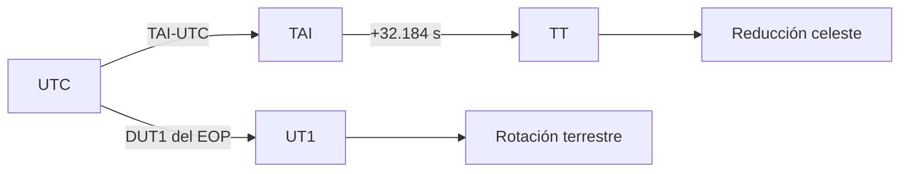

# Temporary systems

[Home](../index.md) · [Engineering](index.md) · [Reference frames](reference-frames.md) · [Formats](../formats/overview.md)

## Principle of contract

An era is interpreted together with `time_scale`. Python does not provide time zones
for GPS, TAI or TT; Orbit preserves the source calendar in an `datetime`
with UTC bearer and declares the scale separately. The wearer does not change the
meaning of the time.

Naive dates that hit compatibility limits are treated as UTC,
but the states and queries of anniversaries require a conscious time
zone/scale.

## Recognized scales

| Scale | Implemented conversion to/from UTC | Requirement |
| --- | --- | --- |
| `UTC` | Yes | None additional. |
| `TAI` | Yes | Modern leap seconds table. |
| `TT` | Yes | TAI and the fixed displacement of 32.184 s. |
| `UT1` | Yes | DUT1 of the EOP provider. |
| `GPS`, `GAL`, `QZS` | Yes | UTC–TAI table. |
| `BDT` | Yes | UTC–TAI table. |
| `GLO` | Yes | Civil convention UTC+3 h of the reader. |
| `IRN` | Recognized, not converted | Explicit origin correlation. |
| `TDB`, `TCB`, `TCG`, `MET`, `MRT`, `SCLK`, `GMST` | Recognized, not converted | Explicit origin correlation. |

An unknown scale is rejected. A recognized but unrelated scale
implemented is not close to UTC.

## Relationships implemented

$$
\mathrm{TT}=\mathrm{TAI}+32.184\ \mathrm{s},
\qquad
\mathrm{UT1}=\mathrm{UTC}+\mathrm{DUT1}.
$$

For GPS, Galileo and QZSS, Orbit uses the encoded calendar relationship
regarding TAI; BDT uses its own offset. The TAI↔UTC conversion looks for
the current entry in the local table. Dates before 1972 are rejected
rather than implicitly modeling previous historical conventions.

UTC cannot represent `23:59:60` with `datetime`. The ordinary times
about a leap second are converted with the table; a literal of
second 60 is not an accepted input by the Python contract.

## UT1 and EOP

### Variables, units and Orbit use

Instants and offsets in these equations use seconds; \(\Delta_{AT}\) and DUT1 are seconds. `TimeScaleConverter` consults the local leap-second table and EOP provider to resolve UTC↔TAI/TT/UT1; it never uses one fixed global offset.

UT1 does not have a fixed civil offset. For an anniversary that is consulted or
declares in UT1, Orbit first gets a provisional UTC, queries EOP,
refine with DUT1 and keep the same transformer leap seconds table.

## Leap seconds tables

`LeapSecondTable` can be loaded from a local `leap-seconds.list` format
IERS/NTP. The runtime calculates SHA-256, can compare an expected hash and
honors the `#@` expiration date when required by policy.

| Variable | Effect |
| --- | --- |
| `ORBIT_LEAP_SECONDS_PATH` | IERS/NTP local file. |
| `ORBIT_LEAP_SECONDS_SHA256` | Expected hash of the file. |
| `ORBIT_LEAP_SECONDS_REQUIRED` | Reject boot without local table. |
| `ORBIT_LEAP_SECONDS_REQUIRE_UNEXPIRED` | Requires a current `#@` date. |
| `ORBIT_EOP_STRICT` | It also makes a current local table mandatory. |

Each `FrameTransformService` can maintain its own immutable table. This
prevents two services of the same process from being contaminated by interpolating epochs or
reduce frames with different snapshots.

## GMST

`gmst_rad` is preserved for the `TEME`/SGP4 path and uses UTC plus DUT1. The route
Modern GCRF/ITRF is not defined solely by GMST: it uses TT, UT1, EOP and the
reduction IAU 2006/2000A when available.

## Limits

- Orbit does not incorporate a general correlation with mission time, SCLK or
  relativistic scales.
- Does not download or update tables during a conversion.
- A visual fallback UTC≈UT1 is marked as approximate and does not satisfy the
  strict EOP policy.

See [Reference frames](reference-frames.md) and
[SP3](../formats/sp3.md) for scales declared by formats.
