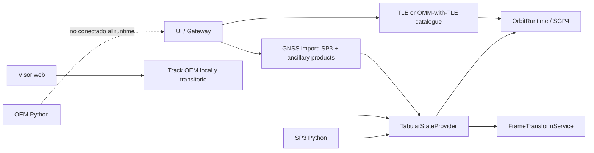

# Format overview

[Home](../index.md) · [Formats](index.md) · [Cartesian states](../engineering/cartesian-states.md) · [Propagation](../propagation/overview.md)

## Availability matrix

| Format | Catalog/UI Import | Python status reader | Propagation in runtime | Export |
| --- | --- | --- | --- | --- |
| [TLE](tle.md) | Yes. | TLE catalog upload. | Yes, SGP4. | TLE; CSV/JSON/OEM ephemeris sampled with SGP4. |
| [OMM](omm.md) | Yes, JSON/XML when it contains TLE. | There is no general status OMM reader. | Yes, like TLE extracted. | OMM JSON/XML minimal. |
| [OEM](oem.md) | The viewer can load a temporary local track; does not create a catalog object. The gateway only extracts embedded TLE. | Yes, segmented and interpolated. | Not integrated into `OrbitRuntime`. | OEM catalog header and OEM SGP4 anniversaries. |
| [SP3](sp3.md) and [precise GNSS products](precise-products.md) | Yes, with required SP3; CLK, ERP, SUM, ATT, and OSB optional/conditional. | Yes, by satellite and interpolated. | Yes, as a runtime tabulated ephemeris; ECI requires ERP and a valid realization route. | No. |
| [OPM](opm.md), [CPF](cpf.md), and observation RINEX | No. | No. | No. | No. |

## Product boundaries

The web viewer has a local and temporary route to view a pure OEM. That route
does not register a catalogue object, go through Gateway/FastAPI, or supply an
ephemeris source to `OrbitRuntime`. By contrast, precise GNSS product import
registers a tabulated SP3 source per satellite with CLK, ERP, SUM, ATT, and OSB
when supplied. The registration is retained in the local precise-product store
and rehydrated by the runtime on startup. ERP is required for ITRF-to-ECI and,
together with a valid realization route, enables that conversion; without it,
output is shown as **Marco terrestre aproximado (sin ERP)**. It does not turn
the product into a TLE object or download files from a provider. See [Precise
GNSS products](precise-products.md).

## Evaluation method by format

This table summarises state queries, not the appearance of a drawn line. The
full distinction between model, sampling, and browser playback is in
[Ephemerides and interpolation](../orbit-service.md).

| Source | Method that obtains the state | What the viewer does with an already sampled path |
| --- | --- | --- |
| TLE / OMM with TLE | SGP4 directly evaluates every epoch. | It joins SGP4 samples with segments; real-time smoothing is visual only. |
| SP3 | Bounded local Lagrange of degree `min(9, n-1)`, up to ten nodes, without extrapolation. | It replays already returned backend samples linearly; it does not run Lagrange in the browser. |
| Python OEM | It honours declared `LINEAR`, `LAGRANGE`, or `HERMITE`; without a declaration it uses linear. | The viewer's local OEM import is different and currently replays points linearly without interpreting the OEM declaration. |
| ERP in a GNSS product | Bounded linear interpolation of Earth-orientation parameters. | It is not a trajectory and cannot move a satellite by itself. |
| CLK, SUM, ATT/OBX, OSB/BIA | No orbital interpolation is implemented. | They do not create a trajectory. |
| OPM | Not supported. | Not applicable. |

## Common tabulated contract

OEM and SP3 become `TabularStateProvider`. Your samples must share
frame, realization, center and temporal scale within a series/segment; the
Epochs are strictly increasing and cannot be duplicated.

| Backend interpolation | Availability |
| --- | --- |
| Linear | Default for OEM when no declaration exists. |
| Lagrange | Declared OEM, with degree and enough samples; SP3 enforces it locally with a maximum degree of 9. |
| Hermite | Declared OEM only, with odd degree and velocity at all selected samples. |

Tabulated queries outside coverage are rejected. OEM covariance is not
interpolated; it is only attached to its exact solution epoch. The browser's
local OEM track is not Python `OemStateProvider` and must not be described as
Hermite or Lagrange support.

## Frames and scales

Readers preserve the origin. A transformation to ITRF requires a path
from the frame service; an IGS realization is not converted to ITRF without a
registered operation. GPS/TAI/TT/UT1 conversions use the same conversion table.
leap seconds and EOP than the associated transformer.

See [Temporary Systems](../engineering/time-systems.md) and
[Reference frames](../engineering/reference-frames.md).

## Simplified OCM

The gateway can export a JSON identified as OCM that contains name,
identifier, source format and the two TLE lines. There is no OCM reader or
an implementation of all OCM profiles; that departure should not be announced
as full support of the standard.
