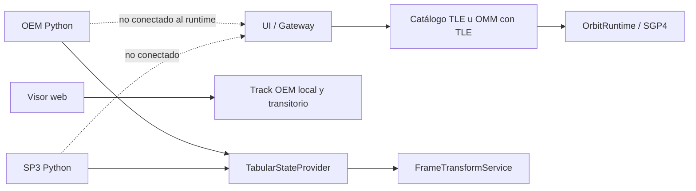

# Format overview

[Home](../index.md) · [Formats](index.md) · [Cartesian states](../engineering/cartesian-states.md) · [Propagation](../propagation/overview.md)

## Availability matrix

| Format | Catalog/UI Import | Python status reader | Propagation in runtime | Export |
| --- | --- | --- | --- | --- |
| [TLE](tle.md) | Yes. | TLE catalog upload. | Yes, SGP4. | TLE; CSV/JSON/OEM ephemeris sampled with SGP4. |
| [WMO](omm.md) | Yes, JSON/XML when it contains TLE. | There is no general status OMM reader. | Yes, like TLE extracted. | OMM JSON/XML minimal. |
| [OEM](oem.md) | The viewer can load a temporary local track; does not create a catalog object. The gateway only extracts embedded TLE. | Yes, segmented and interpolated. | Not integrated into `OrbitRuntime`. | OEM catalog header and OEM SGP4 anniversaries. |
| [SP3](sp3.md) | No. | Yes, by satellite and interpolated. | Not integrated into `OrbitRuntime`. | No. |
| [OPM](opm.md), [CPF](cpf.md), [RINEX](rinex.md) | No. | No. | No. | No. |

## Product boundaries

The web viewer has a local and temporary route to view an OEM
pure. That route does not register a catalog object, it does not go through Gateway/FastAPI
nor does it deliver an ephemeris source to `OrbitRuntime`. Outside of it, there is no
operational import of OEM/SP3 by API nor a runtime integration that
register as catalog satellites. Python readers exist for consumption
library and internal testing.

## Common tabulated contract

OEM and SP3 become `TabularStateProvider`. Your samples must share
frame, realization, center and temporal scale within a series/segment; the
Epochs are strictly increasing and cannot be duplicated.

| Interpolation | Availability |
| --- | --- |
| Linear | Default when no OEM declaration exists. |
| Lagrangian | OEM declared, with grade and enough samples. |
| Hermite | Declared OEM, odd grade and speed on all chosen samples. |

Inquiries outside the coverage are rejected. The OEM covariance is not
interpolates; it is only attached to its exact solution epoch.

## Frames and scales

Readers preserve the origin. A transformation to ITRF requires a path
from the frame service; an IGS realization is not converted to ITRF without a
registered operation. GPS/TAI/TT/UT1 conversions use the same conversion table.
leap seconds and EOP than the associated transformer.

See [Temporary Systems](../engineering/time-systems.md) and
[Reference frames](../engineering/reference-frames.md).

## Simplified OCM

The gateway can export a JSON identified as OCM that contains name,
identifier, source format and the two TLE lines. There is no OCM reader or
an implementation of all OCM profiles; that departure should not be announced
as full support of the standard.