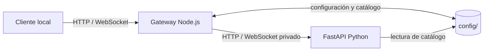

# Integrations

Orbit integrations are done through the company's HTTP gateway.
application. The Python propagation process is a private dependency of the
runtime; It should not be exposed or treated as a second public API.

## Available interfaces

| Interface | State | Intended use |
| --- | --- | --- |
| [REST API](rest-api.md) | Available locally | Catalog, propagation, anniversaries, visibility windows, export and configuration. |
| [WebSocket](websocket.md) | Available locally | States and orbits of a client's active subscriptions. |
| [OpenAPI](openapi.md) | Available locally | Inspection of the FastAPI contract generated during execution. |
| [Plugins](plugins.md) | Internal contract, not distributable | Local ES modules included and reviewed along with source code. |
| [Python SDK](python-sdk.md) | Not available | There is no SDK compatibility package, version, or contract. |
| [CLI](cli.md) | Not available as a product | There are operational scripts and development commands, not a public command line interface. |

## Post limit

The gateway is published by default to `127.0.0.1`. There is no authentication,
authorization, multi-tenancy, quotas, API keys, general rate limiting or
formal public versioning of the API. An instance exposed outside of a network
trust should be protected by appropriate external controls.

The paths, schemas, and compatibility fields described here reflect
the current implementation. They do not constitute a guarantee of stability between
versions until Orbit publishes an API versioning policy.

## Related navigation

- [Architecture](../development/architecture.md)
- [Deployment](../development/deployment.md)
- [Validation](../development/validation.md)
- [Glossary](../reference/glossary.md)