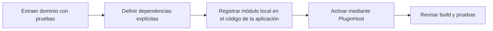

# Plugins

## Plugin system status

Orbit contains an internal class `PluginHost` to organize local ES modules
which are part of the application code. There is no plugin system
installable by users or third parties.

| Capacity | State |
| --- | --- |
| Lifecycle host for local ES modules | Implemented in `front/js/plugins/pluginHost.js`. |
| Registering distributed plugins in the current runtime | Not implemented. |
| Manifesto, marketplace, signature or resolution of dependencies | Not implemented. |
| Dynamic remote code loading | Deliberately not implemented. |
| Backend API for plugins | Not published. |
| Plugin versioning/compatibility | Not defined. |

!!! warning "This is not a public extension API"

    `PluginHost` is an internal architecture utility. Import modules
    internals from an external application does not create a supported integration and
    may break without compatibility notice.

## Current internal contract

A registered local module must provide a unique string identifier and a
`activate` function. `deactivate` is optional.

```js
export const examplePlugin = {
  id: "orbit.example",
  async activate(context) {
    // Inicialización propiedad del módulo.
  },
  async deactivate() {
    // Liberación de recursos propiedad del módulo.
  }
};
```

| Member | Proven requirement |
| --- | --- |
| `id` | Non-empty, unique string within the host. A duplicate produces an error. |
| `activate(context)` | Mandatory; it is invoked by the host in record order each time `PluginHost.start()` is called. |
| `deactivate()` | Optional; the host invokes it in reverse order for the plugins that were activated. |
| `context` | Arbitrary object delivered by the caller. The host does not define or validate a service schema. |

The host retains active plugins after successful activation.
`PluginHost.start()` is not idempotent - a subsequent call re-executes
`activate`. Does not include error isolation, permissions, sandbox,
State serialization nor automatic rollback if a subsequent activation
fails.

## Property rules for embedded code

The following rules describe the separation necessary to convert a
local functionality in maintainable module; They are not an installation mechanism:

1. The module must have its Cesium entities, listeners, interface nodes and
   life cycle state.
2. Activation must receive dependencies explicitly, not seek state
   global nor traverse the DOM outside of its property area.
3. Deactivation should remove listeners and resources created by the module.
4. Changes to routes, configuration keys, and WebSocket payloads must be
   maintain compatibility or document your migration.
5. The module must be accompanied by evidence of the behavior it extracts.

## Internal onboarding flow



The check-in occurs in the repository and in the Orbit image. there is no
downloading or executing third-party code during browser startup.

## Limits and unpublished work

None of the following capabilities should be documented as available:

- Install a package using UI, npm, pip or Orbit CLI.
- Resolve plugins from the Internet, a private registry or a directory
  user.
- Grant permissions per plugin or isolate it from the browser process.
- Add FastAPI/Node routes, propagation models or transformations
  frames from an external plugin.
- Load standalone versions of Cesium, React or dependencies
  runtime.

## Related references

- [Architecture](../development/architecture.md)
- [Contribute](../development/contributing.md)
- [Validation](../development/validation.md)