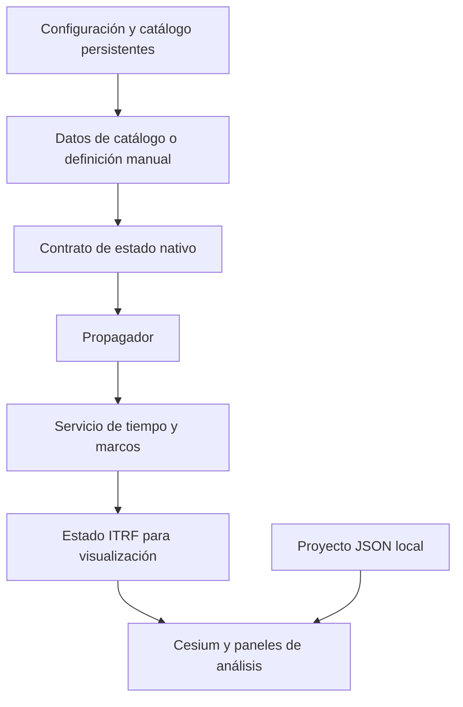

# Introduction to Orbit

[Home](../index.md){ .md-button }

Orbit integrates orbital visualization, element catalog, propagation,
local projects and operational analysis in a local runtime composed of a
3D client, a gateway and a calculation API. The system is designed to
maintain a clear boundary between the input data, the numerical model that
interprets them and the representation used by the interface.

## Purpose

Orbit provides a visual work surface for operations and analysis
with TLE, OMM with TLE and manual orbits. The product exposes the metadata that
determine an orbital result: epoch, time scale, reference frame,
terrestrial realization, units and origin of the orientation data of
the Earth.

The platform does not replace an orbit determination system, a chain
operational navigation nor a high-speed mission analysis environment.
fidelity. Their models and their interfaces are documented with their limits so that
a visualization is not interpreted as scientific validation.

## Functional architecture

The native state contract prevents the interface from implicitly renaming a
generic framework. A TLE spreads in TEME; a manual orbit is documented as
EME2000; conversion to ITRF is done using an explicit path and data
EOP when available.

## Product limits

| Area | State |
| --- | --- |
| Catalog SGP4 Propagation | Available. |
| Manual Two-Body Orbiters, Synthetic SGP4 and Cowell RK4 | Available. |
| 3D viewer, layers, local projects and ground stations | Available. |
| Precision Python SP3/OEM Readers | Available as a library; not integrated as product load. |
| Orbit determination, measurements, maneuvers, conjunctions and Monte Carlo | Not available. |
| Public SDK, Product CLI, Installable Plugins, and Collaboration | Not available. |

## Navigation

- [Getting Started](../getting-started/installation.md): local installation,
  requirements and start.
- [User Guide](../user-guide/index.md): projects, layers, visualization,
  time, seasons and data exchange.
- [Engineering](../engineering/index.md): scientific and software contracts.
- [Propagation](../propagation/index.md): models, forces and precision.
- [Operation](../operations/index.md): local EOP configuration and data.
- [Development Guide](../development/index.md): architecture and testing.

## Reading conventions

Engineering pages use YES unless the input format requires otherwise.
unit. The format pages declare the original drive and the point where it is
normalizes. Pages that describe a missing capability use the status
**Not available** and do not define a future interface.

## Related references

- [Reference frames](../engineering/reference-frames.md)
- [Temporary Systems](../engineering/time-systems.md)
- [Spread](../propagation/overview.md)
- [Architecture](../development/architecture.md)