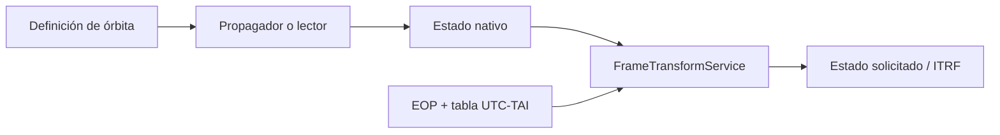

# Propagation overview

[Home](../index.md) · [Propagation](index.md) · [Cartesian states](../engineering/cartesian-states.md) · [Frameworks](../engineering/reference-frames.md)

## Common contract

Modern propagators first expose `native_state_at(instant)` and then
`state_at(instant, target_frame=...)`. The first method preserves the frame and the
scale of the model; the second delegates the frame change to the service
common transformation.

The methods that return six numbers (`propagate_datetime`, `propagate` and
`propagate_offset`) remain as renderer adapters and return the
ITRF status in SI units. They should not be used to infer the native framework.

## Engines available

| Engine | Origin | Native State | Dynamics | Operational availability |
| --- | --- | --- | --- | --- |
| [SGP4](sgp4.md) | TLE | TEME, UTC | SGP4 implementation of `sgp4.api.Satrec`. | Default catalog record. |
| [Two bodies](two-body.md) | Manual elements | EME2000, UTC | Analytical elliptical Kepler. | Manual orbit. |
| [J2](j2.md) | Manual elements | EME2000, UTC | First order analytical secular rates. | Manual compatibility. |
| [Cowell](cowell.md) | Manual status | EME2000, UTC | RK4 fixed, center/J2/J3/J4/drag. | Manual orbit. |
| J2+J3+J4 | Manual status | EME2000, UTC | Fixed RK4 preset without drag. | Manual compatibility. |

The propagator record used by the catalog contains only `sgp4`. there is no
Cowell selector, two bodies nor J2 for a TLE catalog object.

## Frames and units

| Origin | Native framework | Internal units | Contract exit |
| --- | --- | --- | --- |
| SGP4 | FEAR | km, km/s | `StateVector` YES. |
| Two bodies/J2 | EME2000 | km, km/s | `StateVector` YES. |
| Cowell/J2+J3+J4 | EME2000 | km, km/s | `StateVector` YES. |

The transformation to ITRF depends on the ground orientation data. one
visual configuration without local EOP leaves the provenance marked as approximate;
strict mode is described in [Frameworks](../engineering/reference-frames.md).

## Manual selection

Manual routes accept Keplerian elements for two bodies and J2, a
Cartesian state for Cowell and the J2+J3+J4 preset, and an SGP4 route that generates
a synthetic TLE. Synthetic SGP4 result may differ from dynamic
two-body analysis or J2 because it starts from another representation and another
model.

## Global limits

- There is no orbit determination, parameter estimation, maneuvers or
  covariance propagation.
- There is no adaptive integrator, precision events, third bodies, SRP,
  relativity nor complete geopotential.
- The OEM/SP3 reader is a Python tabbed source; is not a propagator
  registered in `OrbitRuntime` nor a UI/API product load.

See [Formats](../formats/index.md) for data sources and
[Force Models](force-models.md) for available forces.