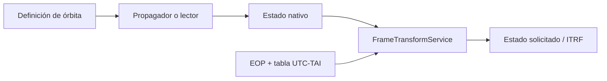

# Propagation overview

[Home](../index.md) · [Propagation](index.md) · [Cartesian states](../engineering/cartesian-states.md) · [Frameworks](../engineering/reference-frames.md)

## Common contract

Modern propagators first expose `native_state_at(instant)` and then
`state_at(instant, target_frame=...)`. The first method preserves the frame and the
scale of the model; the second delegates the frame change to the service
common transformation.

The methods that return six numbers (`propagate_datetime`, `propagate` and
`propagate_offset`) remain as renderer adapters and return the
ITRF status in SI units. They should not be used to infer the native framework.

## Available propagators

A propagator defines how a state evolves. Terms such as zonals, drag,
geopotential, third bodies, SRP, and relativity are
[force models](force-models.md), not propagators: Cowell composes them and the
[RK4](rk4.md) integrator solves the numerical system.

| Propagator | Origin | Native state | Dynamics | Operational availability |
| --- | --- | --- | --- | --- |
| [SGP4](sgp4.md) | TLE | TEME, UTC | SGP4 implementation of `sgp4.api.Satrec`. | Catalogue TLE only. |
| [Two bodies](two-body.md) | Manual elements | EME2000, UTC | Analytical elliptical Kepler. | Manual orbit. |
| [Cowell](cowell.md) | Manual state | EME2000, UTC | Fixed RK4 with validated force composition; includes ICGEM, Sun/Moon, SRP, and Schwarzschild when selected. | Manual orbit. |
| J2+J3+J4 | Manual status | EME2000, UTC | Fixed RK4 preset without drag. | Manual compatibility. |

The propagator record used by the catalog contains only `sgp4`. there is no
Cowell selector, two bodies nor J2 for a TLE catalog object.

## State query, not model interpolation

The propagators in this section compute a state for the requested epoch; they
do not query an intermediate position table.

| Route | Method when an arbitrary instant is requested |
| --- | --- |
| SGP4 / TLE | A direct call to `Satrec.sgp4` at the UTC epoch. |
| Two-body | Analytical mean-anomaly advance and a Kepler solution at that epoch. |
| Cowell/RK4 | Fixed-step RK4 integration with a 60 s maximum step from the nearest cached state; when the target does not fall on the nominal step, it integrates one final shortened step. |
| J2+J3+J4 | Compatibility preset using Cowell's same fixed-step RK4 core. |

Therefore the Cowell cache is not interpolated, and neither SGP4 nor two-body
uses RK4. Drawn orbits do request multiple epochs and Cesium joins those
points; a marker can move linearly between vertices for continuous visual
playback. That is not another propagator evaluation.

For the matrix also covering SP3, OEM, ERP, and the distinction between the
Python route and the viewer's local OEM import, see
[Ephemerides and interpolation](../orbit-service.md).

## Frames and units

| Origin | Native framework | Internal units | Contract exit |
| --- | --- | --- | --- |
| SGP4 | FEAR | km, km/s | `StateVector` YES. |
| Two bodies | EME2000 | km, km/s | `StateVector` YES. |
| Cowell/J2+J3+J4 | EME2000 | km, km/s | `StateVector` YES. |

The transformation to ITRF depends on the ground orientation data. one
visual configuration without local EOP leaves the provenance marked as approximate;
strict mode is described in [Frameworks](../engineering/reference-frames.md).

## Manual selection

Manual routes accept Keplerian elements for two-body propagation, a Cartesian
state for Cowell, and the compatibility J2+J3+J4 preset. The input and
dynamics of those models are defined in `EME2000`; if the view or an output
ephemeris needs an Earth-fixed frame, it is transformed to `ITRF` afterwards.

SGP4 does not take part in this selection. It consumes a catalogue TLE and
keeps `TEME` as its native frame; reusing manual EME2000 elements as though
they were NORAD mean elements is not a valid frame conversion.

!!! warning "Not available: synthetic TLE fit"

    Exporting a TLE from a manual orbit will require an explicit fitting
    operation: sample a reference ephemeris, express it in TEME, and fit an
    SGP4/TLE model over an interval while declaring residuals and provenance.
    It is not part of current manual propagation.

## Global limits

- There is no orbit determination, parameter estimation, maneuvers or
  covariance propagation.
- There is no adaptive integrator, precision events, STM/covariance, maneuvers,
  tides, albedo/IR, high-fidelity atmosphere, or attitude-dependent SRP.
- Available forces do not turn fixed 60 s RK4 into a mission ephemeris; they
  require their auxiliary data and validation against a reference.
- The OEM/SP3 reader is a Python tabbed source; is not a propagator
  registered in `OrbitRuntime` nor a UI/API product load.

See [Formats](../formats/index.md) for data sources,
[Numerical integrators](numerical-integrators.md) for RK4, and
[Force models](force-models.md) for the available forces.
