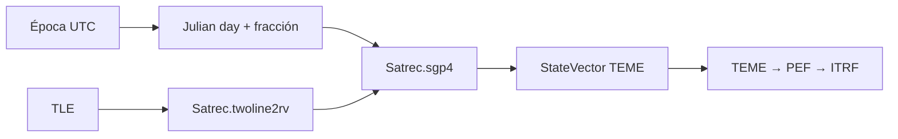

# SGP4

[Home](../index.md) · [Propagation](index.md) · [TLE](../formats/tle.md) · [Reference Frames](../engineering/reference-frames.md)

## Purpose

`SGP4Propagator` propagates a two-line set using `sgp4.api.Satrec`.
It is the default registered engine for catalog objects and retains
that the native state of SGP4 is expressed in `TEME`.

## Entry and exit

| Appearance | Contract |
| --- | --- |
| Entry | Two valid TLE lines for `Satrec.twoline2rv`. |
| Consultation period | UTC; It is used to construct the Julian date of SGP4. |
| Native State | Position km and speed km/s of SGP4, converted to SI in `StateVector`. |
| Native framework | `TEME`. |
| renderer output | ITRF requested via `FrameTransformService`. |
| Origin | `source=TLE`, `propagator=sgp4`, `native_frame=TEME`. |

## Calculation flow

If SGP4 returns an error code, `native_state_at` fails by default. The
non-strict internal mode retains a compatibility warning, but does not
is the recommended contract for a scientific application.

## Time and frame

SGP4 production uses the UTC query epoch. For land departure, the
TEME route uses model-compatible GMST rotation and polar motion.
A legacy DUT1 value can be injected into the constructor, but the path
recommended is a versioned EOP provider on the shared transformer.

A TEME state should not be labeled as GCRF, EME2000 or ECI. See
[Reference frames](../engineering/reference-frames.md).

## Manual use

The manual orbit interface can select SGP4 using a TLE
synthetic generated from its fields. That path is useful to compare the output
SGP4 operational; does not convert manual elements into a physical model
equivalent to two bodies, J2 or Cowell.

## Accuracy and limitations

- Fidelity depends on the quality, period and regime of use of the TLE of
  origin; Orbit does not reconstruct a TLE history or adjust its parameters.
- There is no force selection, configurable drag, propagated covariance or
  events associated with SGP4.
- The catalog ephemeris export endpoint currently accepts
  only `sgp4`.
- The TEME→ITRF transformation is conditioned by the EOP policy; the
  visual fallback is marked as approximate.

For the input format and its validations, see [TLE](../formats/tle.md).