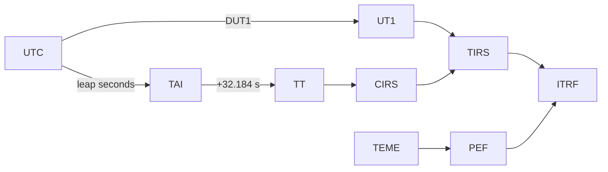

# Appendix

## Summary operating contracts

This appendix consolidates rules that affect results, integrations and
operation. It does not replace the specification of each endpoint or module.

## Units and states

| Element | Contract |
| --- | --- |
| Internal position `StateVector` | meters (m). |
| Internal speed `StateVector` | meters per second (m/s). |
| Internal acceleration `StateVector` | meters per second squared (m/s²). |
| Covariance | 6×6 Cartesian matrix if available. |
| Keplerian manual entries | Semimajor axis in km; angles in degrees. |
| Cartesian manual inputs | Position in km; speed in km/s. |
| WebSocket State/Rendering | ITRF, position in m and speed in m/s. |
| Inspector Osculating Elements | State and elements expressed in km, km/s and degrees depending on the field. |

A unit should not be inferred from the name of a property when the answer
includes an explicit declaration of units.

## Time string and frames

| Source | Native framework | Output Transformation |
| --- | --- | --- |
| TLE/SGP4 | FEAR | TEME→PEF→ITRF. |
| Two-body manual | EME2000 | EME2000→CIRS→TIRS→ITRF. |
| Cowell/RK4 Manual | EME2000 | EME2000→CIRS→TIRS→ITRF. |
| OEM/SP3 tabular | Declared for the product. | Only when there is supported transformation and sufficient metadata. |

The implementation does not accept `ECI` or `ECEF` as new frame tags.
ITRF is a family of implementations; a concrete realization is preserved or
It is declared explicitly when the operation requires it.

## EOP and leap seconds policies

| Mode | Behavior |
| --- | --- |
| Approximate visual | Can operate without local EOP snapshot; transformations are marked as approximate. It is not appropriate for a result that requires precision traceability. |
| EOP configured | Loads a local C04, preserves source/snapshot identity and applies its coverage according to policy. |
| Strict EOP | Requires local C04, compatible configuration, local UTC–TAI table, current data and range coverage. Reject extrapolation. |

Key variables:

| Variable | Function |
| --- | --- |
| `ORBIT_EOP_C04_PATH` | Path of the local C04 snapshot in the process/container. |
| `ORBIT_EOP_C04_SHA256` | Expected hash of file C04. |
| `ORBIT_EOP_STRICT` | Enables strict EOP and leap seconds requirements. |
| `ORBIT_EOP_REQUIRED_START` / `ORBIT_EOP_REQUIRED_END` | Operational window that must be covered by C04 and UTC–TAI table. |
| `ORBIT_LEAP_SECONDS_PATH` | Local table path `leap-seconds.list`. |
| `ORBIT_LEAP_SECONDS_SHA256` | Expected hash of the leap seconds table. |
| `ORBIT_TERRESTRIAL_REALIZATION` | Land realization of controlled exit. |
| `ORBIT_ENABLE_IGS20_ITRF2020_ALIGNMENT` | Activate the optional global alignment IGS20↔ITRF2020 under its preconditions. |

Routes are configured within the environment that runs Orbit. With Compose,
Files mounted in `./config` are normally seen under `/app/config`.

## Current resource limits

| Resource | Limit or policy |
| --- | --- |
| Gateway JSON Body | 25MB. |
| Python Proxy Timeout | 30s. |
| Handshake WebSocket | 10s. |
| API Orbit Samples | 2–7200. |
| API Orbit Horizon | 0.1–8760 h. |
| Anniversary series | Up to 20,000 points; step > 0 and ≤ 3600 s. |
| Orbital parameters | 2–2000 samples; additional budget for RK4 routes. |
| runtime orbit cache | TTL 10s. |
| Ephemeris cache | LRU 256, TTL 120 sec. |
| WebSocket State | Default interval of 1 s. |
| WebSocket Orbits | Default interval of 10s if future orbit is enabled. |

These values are present implementation limits, not a guarantee of
throughput or production latency.

## HTTP Error Summary

| Situation | Typical result |
| --- | --- |
| Malformed JSON in gateway | `400`. |
| JSON exceeding gateway limit | `413`. |
| Form or value incompatible with FastAPI model | `422`. |
| Satellite/entry not found | `404` on routes that resolve it explicitly. |
| Python backend not accessible from gateway | `502`. |
| Gateway started but backend not available | `GET /health` returns `503`. |
| Configuration/catalog persisted without effective reload | `503` with indication of persistence on the routes that report it. |

Not all errors share a single JSON wrapper. Clients must
interpret HTTP status, content type and body of the specific route.

## Reproducibility checklist

Before comparing or exporting an orbital result:

1. Register the Orbit version/commit.
2. Register TLE, initial state, OEM/SP3 or exact catalog entry.
3. Record propagator, force terms, step and range.
4. Register frames, terrestrial realization, time scale and units.
5. Record EOP snapshot, hash and leap seconds table if involved.
6. Confirm that the interval is within the configured coverage.
7. Record whether the route used the approximate visual mode.
8. Keep the entire answer, not just rounded positions.

## Related references

- [Glossary](glossary.md)
- [Bibliography](bibliography.md)
- [REST API](../integrations/rest-api.md)
- [Deployment](../development/deployment.md)
- [Validation](../development/validation.md)