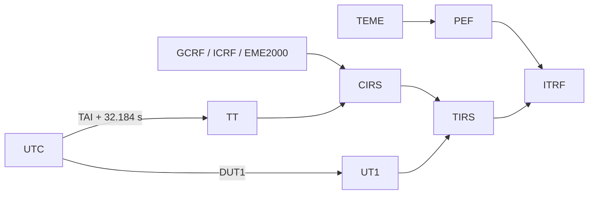

# Glossary

## Scope

This glossary uses the terminology that appears in the contracts implemented by
Orbit. The definitions of geodetic and temporal reference are complemented by
the sources of [Bibliography](bibliography.md).

!!! note "Precision convention"

    An acronym does not replace metadata. A usable state must declare
    minus epoch, time scale, frame, center and units. When applicable,
    It must also declare terrestrial realization and origin of EOP.

## Time and Earth Orientation

| Term | Definition in Orbit |
| --- | --- |
| **UTC** | Civilian time scale used in HTTP routes and most user input. Dates must be sent with time zone. |
| **TAI** | International Atomic Time. Orbit can convert UTC↔TAI with a leap seconds table. |
| **TT** | Earth Time. It is obtained from TAI by adding 32.184 s and participates in the high-precision celestial chain. |
| **UT1** | Scale linked to the rotation of the Earth. Orbit obtains it from UTC via DUT1 when an appropriate EOP provider exists. |
| **DUT1** | UT1−UTC difference included in EOP products. It is necessary for an explicit relationship between UTC and Earth's rotation. |
| **Leap second** | Setting that relates UTC to TAI. Orbit can load a local table with hash, coverage, and declared expiration date. |
| **EOP** | Earth Orientation Parameters. Set of ground orientation parameters, including DUT1 and polar motion. |
| **IERS C04** | IERS EOP tabular product. Orbit strict mode uses an identified local snapshot, not a download during the transformation. |
| **dX, dY** | Corrections of the coordinates of the celestial pole with respect to the IAU 2000A model. Orbit validates C04 with these columns; does not accept the legacy dPsi/dEps header for that contract. |
| **xp, yp** | Components of polar motion. They participate in the TIRS/PEF→ITRF transformation. |
| **GMST** | Greenwich Mean Sidereal Time. It is a rotation quantity; Orbit recognizes it as a scale label, but not as an automatically interchangeable time scale. |
| **Time scale** | Label that defines how to interpret an era. Orbit recognizes UTC, TAI, TT, UT1, GPS, GAL, QZS, BDT, GLO and other tags that it does not convert automatically. |

## Frameworks and realizations

| Term | Definition in Orbit |
| --- | --- |
| **StateVector** | Orbit Cartesian contract with epoch, scale, frame, realization, center, SI position and optional velocity, acceleration, covariance and provenance fields. |
| **FEAR** | True Equator Mean Equinox. Native framework of the states propagated with SGP4 in Orbit. |
| **EME2000** | J2000 mid-equatorial frame used as native frame for manual two-body and Cowell orbits. |
| **GCRF** | Geocentric Celestial Reference Frame. Explicit geocentric celestial frame supported by the transformations service. |
| **ICRF** | International Celestial Reference Frame. Conducting ICRS; Orbit retains it as an explicit framework. |
| **CIRS** | Celestial Intermediate Reference System. Intermediate frame of the celestial route based on precession-nutation. |
| **TIRS** | Terrestrial Intermediate Reference System. Intermediate terrestrial frame before the polar movement. |
| **PEF** | Pseudo-Earth Fixed. Intermediate frame used in the TEME→PEF→ITRF route. |
| **ITRS** | International Terrestrial Reference System, conceptual terrestrial reference system. |
| **ITRF** | International Terrestrial Reference Frame. The name groups a family or series of ITRS implementations; ITRF2020 is a concrete realization. In Orbit it may be necessary to declare the specific implementation. |
| **IGS20** | IGS implementation related to ITRF2020. Orbit only enables IGS20↔ITRF2020 global alignment through explicit configuration. |
| **IGb20 / IGc20** | IGS realizations whose identifier is preserved; Orbit does not apply an implicit conversion towards ITRF2020. |
| **Terrestrial realization** | Concrete implementation of a terrestrial system, with its own time and conventions. It should not be replaced by the generic ITRF label. |
| **ECI / ECEF** | Ambiguous generic labels. `StateVector` rejects them because they do not identify a sufficient model, realization, or transformation path. |

The land reduction implemented distinguishes two routes:

## Propagation and states

| Term | Definition in Orbit |
| --- | --- |
| **Propagator** | Engine that obtains a state from a definition and an epoch. |
| **SGP4** | Model used for TLE entries. His native state is TEME. |
| **Two bodies** | Manual analytical propagator with idealized central gravity and native state EME2000. |
| **Cowell/RK4** | Fixed pitch numerical manual propagator. Supports center gravity, J2/J3/J4 and exponential drag as selectable terms; the published integrator is RK4. |
| **Legacy J2 / J2-J3-J4** | Routes preserved for existing projects. They are not new selectable families at the same level as Cowell/RK4. |
| **TLE** | Two-Line Element set. Catalog representation used by SGP4. |
| **BSTAR** | Trailing term included in a TLE/SGP4. Orbit does not support additional manual drag on an SGP4 manual orbit. |
| **Anniversary** | Series of states or points sampled in an interval. The API limits the series to 20,000 points. |
| **Osculating state** | Instantaneous elements derived from a state vector under the two-body model for inspection. They are not an orbit determination. |
| **YEARS / LOS** | Acquisition Of Signal / Loss Of Signal; beginning and end of a visibility window. Orbit extracts them from elevation samples. |
| **TTL/LRU cache** | Temporary storage with expiration and capacity limit. Orbit uses TTL for orbits and LRU/TTL for ephemeris. |

## Formats and data

| Term | Definition in Orbit |
| --- | --- |
| **WMO** | Orbit Mean-Elements Message from the ODM family. Orbit imports OMM JSON/XML when it contains the necessary TLE data and can export a limited representation. |
| **OEM** | Orbit Ephemeris Message. Orbit contains a segmented Python reader and can generate simplified exports; loading a hi-fi OEM is not a public UI/REST path. |
| **OCM** | Orbit Comprehensive Message. Orbit generates simplified JSON output; does not declare complete coverage of the standard. |
| **SP3** | GNSS orbit and clock format. There is a Python reader with state metadata; no SP3 import is published by UI, gateway or API. |
| **Covariance** | 6×6 Cartesian uncertainty matrix when provided by the source. Orbit preserves Cartesian OEM covariance; does not accept RTN/RSW/TNW blocks. |
| **Lagrange interpolation** | Polynomial interpolation over tabular samples. The grade requires a corresponding number of points. |
| **Hermite Interpolation** | Interpolation using position and velocity; The OEM reader requires odd grade and compatible number of samples. |
| **Provenance** | Metadata that identifies source, version, quality or snapshot of data used in a state/transformation. |

## Runtime and integrations

| Term | Definition in Orbit |
| --- | --- |
| **Gateway** | Published Node.js process that serves the frontend and mediates access to the Python backend. |
| **Python Backend** | Private FastAPI process for orbital calculation and WebSocket. |
| **OpenAPI** | Document generated by FastAPI in `/openapi.json` and published by the gateway. It does not fully describe Node's own routes. |
| **WebSocket** | `/ws` channel of catalog, state and orbit snapshots for a customer's subscriptions. |
| **PluginHost** | Internal lifecycle utility for local ES modules. It is not a system of distributable plugins. |
| **Strict EOP mode** | Policy requiring local snapshots and proper coverage/identity in ground orientation dependent transformations. |

## Related references

- [Appendix](appendix.md)
- [REST API](../integrations/rest-api.md)
- [Validation](../development/validation.md)
- [Bibliography](bibliography.md)