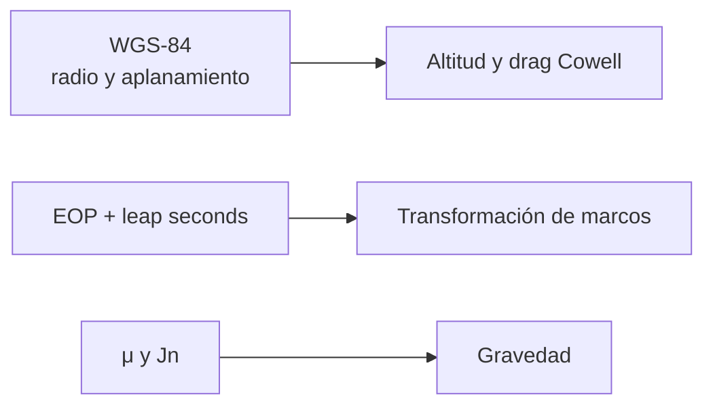

# Modelos de la Tierra

[Inicio](../index.md) · [Ingeniería](index.md) · [Modelos de gravedad](gravity-models.md) · [Sistemas temporales](time-systems.md)

## Componentes terrestres usados

Orbit no concentra la Tierra en un único modelo. Cada subsistema usa un
contrato limitado y explícito.

| Componente | Uso implementado | Datos o constantes |
| --- | --- | --- |
| Parámetro gravitatorio | Elementos clásicos, dos cuerpos y Cowell. | \(\mu=398600.4418\ \mathrm{km^3/s^2}\). |
| Radio ecuatorial | Validación de perigeo, gravedad zonal y geometría del drag. | \(R_e=6378.137\ \mathrm{km}\). |
| Elipsoide WGS-84 | Altitud geométrica del modelo de drag. | Aplanamiento \(1/298.257223563\). |
| Rotación terrestre | Velocidad relativa de la atmósfera y adaptadores históricos. | \(\omega=7.2921150\times10^{-5}\ \mathrm{rad/s}\). |
| Orientación terrestre | Reducción de marcos. | EOP IERS C04 configurables: DUT1, \(x_p\), \(y_p\), \(dX\), \(dY\), LOD. |

## Orientación frente a figura

La forma WGS-84 empleada por Cowell es una aproximación de geometría para
altitud. La orientación terrestre para pasar entre marcos se calcula por el
servicio de marcos con EOP y, si está instalado `pyerfa`, la ruta IAU
2006/2000A. Son responsabilidades distintas.

## Política de precisión

Sin una configuración EOP local, el runtime permite una aproximación visual
UTC≈UT1 y la marca como `approximate` en la procedencia. El modo estricto
requiere EOP final o rapid y una tabla local de segundos intercalares
identificada; si `pyerfa` no está disponible, el modo estricto rechaza la
reducción en lugar de degradarla silenciosamente.

## No incluido

- Modelo geoidal, DEM, terreno, océanos, mareas sólidas, cargas o desplazamientos de estación.
- Campo gravitatorio completo, mareas de potencial o modelos de orientación planetaria fuera de la Tierra.
- Atmósfera meteorológica, solar o geomagnética de alta fidelidad.

Véanse [Marcos de referencia](reference-frames.md),
[Modelos de gravedad](gravity-models.md) y
[Modelo atmosférico](atmospheric-models.md).
