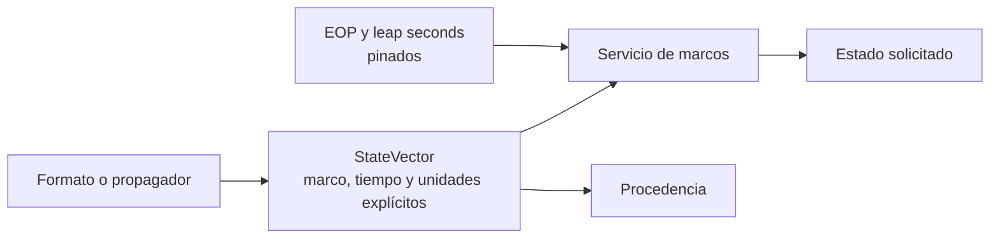

# Ingeniería orbital

[Inicio](../index.md) · [Propagación](../propagation/index.md) · [Formatos](../formats/index.md)

Esta sección define los contratos numéricos de Orbit. Las páginas describen el
comportamiento implementado por el servicio Python; no convierten las etiquetas
de interfaz en afirmaciones de fidelidad científica.

## Mapa de contratos

| Tema | Contrato documentado |
| --- | --- |
| [Estados cartesianos](cartesian-states.md) | `StateVector`, unidades SI, velocidad, aceleración, covarianza y procedencia. |
| [Representaciones orbitales](orbit-representations.md) | Representaciones que Orbit acepta o conserva. |
| [Elementos keplerianos](keplerian-elements.md) | Elementos medios elípticos de las órbitas manuales. |
| [Elementos equinocciales](equinoctial-elements.md) | Estado de soporte: no disponible. |
| [Marcos de referencia](reference-frames.md) | Marcos admitidos, rutas de transformación y realizaciones terrestres. |
| [Sistemas temporales](time-systems.md) | Escalas, segundos intercalares y EOP. |
| [Sistemas de coordenadas](coordinate-systems.md) | Alcance de coordenadas y convenciones espaciales. |
| [Modelos de la Tierra](earth-models.md) | Constantes y productos terrestres usados por el runtime. |
| [Modelos de gravedad](gravity-models.md) | Gravedad central y armónicos zonales disponibles. |
| [Modelo atmosférico](atmospheric-models.md) | Atmósfera exponencial de primer orden para Cowell. |

!!! warning "Regla de interpretación"

    Un vector no adquiere un marco, una realización ni una escala temporal por
    el contexto de la vista. Si un origen no los declara de forma suficiente,
    Orbit rechaza la transformación o conserva la etiqueta original.

## Relación con los demás subsistemas

Los lectores tabulados y los propagadores se describen en
[Formatos](../formats/index.md) y [Propagación](../propagation/index.md).
