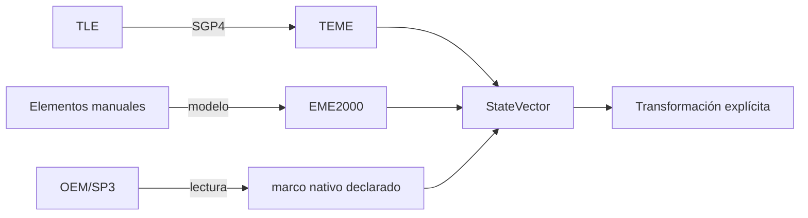

# Representaciones orbitales

[Inicio](../index.md) · [Ingeniería](index.md) · [Estados cartesianos](cartesian-states.md) · [Elementos keplerianos](keplerian-elements.md)

## Alcance

Orbit separa la representación de un estado de su fuente dinámica. Un TLE,
unos elementos keplerianos y una efeméride OEM/SP3 pueden acabar en un
`StateVector`, pero no son intercambiables ni conservan la misma semántica.

| Representación | Estado | Uso implementado | Marco/tiempo que no debe inferirse |
| --- | --- | --- | --- |
| Estado cartesiano | Disponible | Contrato común de todos los proveedores. | Siempre explícito en el estado. |
| Elementos keplerianos medios | Disponible | Entrada de órbitas manuales de dos cuerpos y J2. | Se interpretan en `EME2000` con época UTC del modelo manual. |
| TLE | Disponible | Catálogo y SGP4. | El estado SGP4 nativo es `TEME`. |
| OEM/SP3 tabulado | Lector Python disponible | Muestras nativas e interpolación acotada. | Lo declara el fichero por segmento/serie. |
| Elementos equinocciales | No disponible | No hay entrada, conversor ni exportador. | No aplicable. |
| OPM/OCM como estado físico completo | No disponible | No se usa como fuente de propagación. | No aplicable. |

## Regla de conservación

Un proveedor entrega primero su estado nativo. La conversión a un marco de
consumo se solicita después y queda registrada en la procedencia.

La arquitectura evita convertir un estado de origen a una etiqueta genérica
antes de saber qué reducción o realización se requiere.

## Representación frente a modelo

Una representación no determina el modelo de fuerzas:

- TLE implica el uso de SGP4 en el catálogo de Orbit.
- Los elementos manuales pueden alimentar dos cuerpos o el modelo analítico
  J2 de compatibilidad; también existe una ruta SGP4 mediante TLE sintético.
- Cowell requiere un estado cartesiano manual en `EME2000`, no una conversión
  automática desde cualquier representación.
- OEM y SP3 son fuentes tabuladas; su lector interpola dentro de la cobertura,
  no integra ecuaciones de movimiento.

Consulte [Propagación](../propagation/overview.md) y
[Formatos](../formats/overview.md) para el contrato de cada fuente.

## Límites de conversión

Orbit no publica una conversión general entre todas las representaciones. En
particular, no implementa elementos equinocciales, estados hiperbólicos o
parabólicos manuales, conversión de covarianzas a elementos y determinación de
órbita a partir de observaciones.
