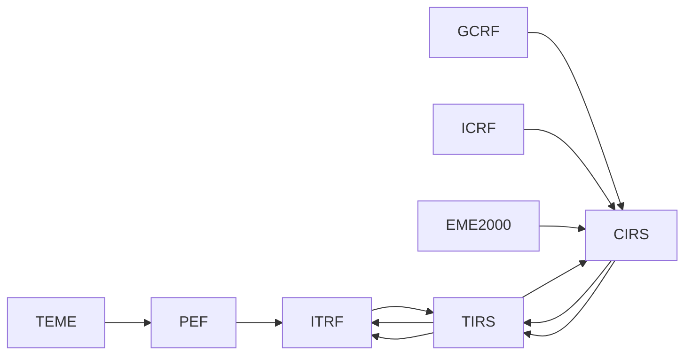

# Marcos de referencia

[Inicio](../index.md) · [Ingeniería](index.md) · [Estados cartesianos](cartesian-states.md) · [Sistemas temporales](time-systems.md)

## Propósito

`FrameTransformService` separa la producción de un estado nativo de la vista
en el marco solicitado. No renombra vectores para satisfacer al consumidor:
calcula una ruta compatible o devuelve un error.

Las transformaciones integradas son geocéntricas y requieren `center = EARTH`.
Los estados conservan su escala temporal original; UTC se obtiene internamente
solo para la reducción con EOP y segundos intercalares.

## Marcos admitidos

| Familia | Identificadores | Tratamiento |
| --- | --- | --- |
| SGP4 | `TEME` | Ruta clásica TEME → PEF → ITRF mediante GMST82 y movimiento polar. |
| Inerciales celestes | `GCRF`, `ICRF`, `EME2000` | Ruta celeste-terrestre IAU 2006/2000A cuando `pyerfa` está disponible. |
| Intermedios | `CIRS`, `TIRS`, `PEF` | Conexión explícita con rotación terrestre y movimiento polar. |
| Terrestre | `ITRF` | Marco de salida o tránsito; su realización puede declararse. |
| Terrestres externas | `IGS*`, `WGS84`, `PZ90` | Se conservan como origen y necesitan una operación de realización registrada. |

`J2000` y `EME2K` son alias de `EME2000`; `ITRS` es alias de `ITRF`. Las
etiquetas genéricas `ECI` y `ECEF` se rechazan.

## Marcos de órbitas manuales y de catálogo

La elección del propagador no autoriza a cambiar el nombre del marco. Orbit
mantiene estas separaciones:

| Origen | Marco de entrada y dinámica | Vista terrestre generada |
| --- | --- | --- |
| Órbita manual de dos cuerpos o Cowell/RK4 | `EME2000` | `ITRF`, mediante una transformación posterior. |
| TLE de catálogo con SGP4 | `TEME` | `ITRF`, por la ruta TEME→PEF→ITRF. |

La opción terrestre de una órbita manual no es un segundo integrador: expresa
la misma efeméride `EME2000` en `ITRF` para el globo, el mapa o una salida
terrestre. Por eso las etiquetas visibles deben ser `EME2000` e `ITRF`, no
`ECI` ni `ECEF`.

Un futuro TLE sintético requerirá ajustar el modelo SGP4 sobre una efeméride
de referencia expresada en TEME. No se obtiene al rotar directamente un estado
manual EME2000 y no es una transformación de marcos implementada.

## Rutas de transformación



La ruta `TEME` usa GMST compatible con el contexto SGP4. La ruta
`GCRF`/`ICRF`/`EME2000` usa TT, UT1, correcciones de polo celeste `dX/dY`,
rotación terrestre y movimiento polar. Para `EME2000` se aplica además el
sesgo de marco devuelto por la reducción IAU/SOFA.

## Datos de orientación terrestre

`EarthOrientation` contiene DUT1, \(x_p\), \(y_p\), \(dX\), \(dY\) y LOD,
además de fuente, versión, calidad y una identidad de snapshot. El proveedor
tabular interpola linealmente registros EOP fechados; fuera de la cobertura
falla salvo que se haya permitido extrapolación de forma explícita.

El lector local acepta C04-14 y C04-20 con la convención IAU 2000A `dX/dY`.
Rechaza cabeceras que declaran el producto legado `dPsi/dEps` para evitar una
reducción CIO físicamente incorrecta.

| Política | Efecto |
| --- | --- |
| Visual predeterminada | UTC≈UT1 y EOP nulo; el estado queda marcado `approximate`. |
| Snapshot configurado | Se conserva fuente, versión, hash y cobertura del archivo local. |
| `ORBIT_EOP_STRICT=true` | Exige C04 local, calidad `final` o `rapid`, sin extrapolación y tabla local de leap seconds. |

En modo estricto, la ausencia de `pyerfa` también es un error: Orbit no usa la
aproximación visual como sustituto de la reducción IAU 2006/2000A.

## Realizaciones terrestres

ITRF es una familia de realizaciones, no una autorización para relabelar
coordenadas. Un estado ITRF sin realización no se puede convertir a una
realización concreta sin una operación de datum registrada.

La operación global publicada incluida como helper cubre la familia
`IGS20 ↔ ITRF2020`, `IGb20 ↔ ITRF2020` e `IGc20 ↔ ITRF2020`, con parámetros de
datum globales nulos. Está deshabilitada por defecto y requiere:

```text
ORBIT_TERRESTRIAL_REALIZATION=ITRF2020
ORBIT_ENABLE_IGS20_FAMILY_ITRF2020_ALIGNMENT=true
```

Se aplica solamente a estados orbitales geocéntricos declarados `IGS20`,
`IGb20` o `IGc20`; no aplica correcciones de estación, antena ni convenciones
de producto. Orbit conserva la etiqueta fuente en la procedencia, por lo que
no existe una conversión o relabelado silencioso. El ajuste histórico
`ORBIT_ENABLE_IGS20_ITRF2020_ALIGNMENT` se mantiene para despliegues que
requieren exactamente su política anterior, pero no puede activarse junto con
la política de familia. `IGS14` y otras realizaciones históricas permanecen
sin ruta hasta registrar una operación publicada explícita.

## Velocidad, aceleración y covarianza

La matriz de transformación se diferencia numéricamente en una ventana de
0,5 s a cada lado de la época. Esto incorpora la derivada de la rotación en
velocidad y aceleración, y permite transportar una covarianza cartesiana 6×6.
Véanse las ecuaciones en [Estados cartesianos](cartesian-states.md).

## Configuración relevante

| Variable | Finalidad |
| --- | --- |
| `ORBIT_EOP_C04_PATH` | Ruta local del snapshot IERS C04. |
| `ORBIT_EOP_C04_SHA256` | Hash esperado del C04. |
| `ORBIT_EOP_C04_REQUIRE_SHA256` | Obliga a declarar el hash. |
| `ORBIT_EOP_STRICT` | Activa la política de precisión. |
| `ORBIT_EOP_REQUIRED_START` / `END` | Ventana que deben cubrir EOP y leap seconds al iniciar. |
| `ORBIT_TERRESTRIAL_REALIZATION` | Realización terrestre de salida fijada por el despliegue. |

La configuración no descarga productos durante una transformación. Consulte
[Sistemas temporales](time-systems.md) para la tabla UTC–TAI y
[OEM](../formats/oem.md) o [SP3](../formats/sp3.md) para realizaciones de
origen.

## Límites

- No hay transformaciones planeta-centro, baricéntricas ni topocéntricas.
- No se deduce equivalencia IGS–ITRF a partir del nombre del marco.
- El fallback sin `pyerfa` es solo visual; no debe usarse para análisis o
  exportación de precisión.
- No se implementan marcos orbitales locales RSW/RTN/TNW.
