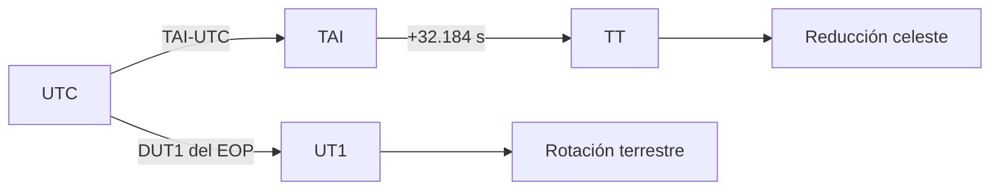

# Sistemas temporales

[Inicio](../index.md) · [Ingeniería](index.md) · [Marcos de referencia](reference-frames.md) · [Formatos](../formats/overview.md)

## Principio de contrato

Una época se interpreta junto con `time_scale`. Python no aporta zonas horarias
para GPS, TAI o TT; Orbit conserva el calendario de origen en un `datetime`
con portador UTC y declara la escala separadamente. El portador no cambia el
significado de la época.

Las fechas ingenuas que llegan a límites de compatibilidad se tratan como UTC,
pero los estados y las consultas de efemérides requieren una época consciente
de zona/escala.

## Escalas reconocidas

| Escala | Conversión implementada a/desde UTC | Requisito |
| --- | --- | --- |
| `UTC` | Sí | Ninguno adicional. |
| `TAI` | Sí | Tabla de segundos intercalares moderna. |
| `TT` | Sí | TAI y el desplazamiento fijo de 32,184 s. |
| `UT1` | Sí | DUT1 del proveedor EOP. |
| `GPS`, `GAL`, `QZS` | Sí | Tabla UTC–TAI. |
| `BDT` | Sí | Tabla UTC–TAI. |
| `GLO` | Sí | Convención civil UTC+3 h del lector. |
| `IRN` | Reconocida, no convertida | Correlación de origen explícita. |
| `TDB`, `TCB`, `TCG`, `MET`, `MRT`, `SCLK`, `GMST` | Reconocidas, no convertidas | Correlación de origen explícita. |

Una escala desconocida se rechaza. Una escala reconocida pero sin relación
implementada no se aproxima a UTC.

## Relaciones implementadas

$$
\mathrm{TT}=\mathrm{TAI}+32.184\ \mathrm{s},
\qquad
\mathrm{UT1}=\mathrm{UTC}+\mathrm{DUT1}.
$$

Para GPS, Galileo y QZSS, Orbit usa la relación de calendario codificada
respecto a TAI; BDT usa su desplazamiento propio. La conversión TAI↔UTC busca
la entrada vigente en la tabla local. Las fechas anteriores a 1972 se rechazan
en lugar de modelar de forma implícita las convenciones históricas previas.

UTC no puede representar `23:59:60` con `datetime`. Las épocas ordinarias
alrededor de un segundo intercalar se convierten con la tabla; un literal de
segundo 60 no es una entrada aceptada por el contrato Python.

## UT1 y EOP

UT1 no tiene un offset civil fijo. Para una efeméride que se consulta o se
declara en UT1, Orbit obtiene primero una UTC provisional, consulta EOP,
refina con DUT1 y conserva la misma tabla de leap seconds del transformador.

## Tablas de segundos intercalares

`LeapSecondTable` puede cargarse desde un `leap-seconds.list` local de formato
IERS/NTP. El runtime calcula SHA-256, puede comparar un hash esperado y
respeta la fecha de caducidad `#@` cuando la política lo requiere.

| Variable | Efecto |
| --- | --- |
| `ORBIT_LEAP_SECONDS_PATH` | Archivo local IERS/NTP. |
| `ORBIT_LEAP_SECONDS_SHA256` | Hash esperado del archivo. |
| `ORBIT_LEAP_SECONDS_REQUIRED` | Rechaza el arranque sin tabla local. |
| `ORBIT_LEAP_SECONDS_REQUIRE_UNEXPIRED` | Exige una fecha `#@` vigente. |
| `ORBIT_EOP_STRICT` | También hace obligatoria una tabla local vigente. |

Cada `FrameTransformService` puede mantener su propia tabla inmutable. Esto
evita que dos servicios del mismo proceso se contaminen al interpolar épocas o
reducir marcos con snapshots diferentes.

## GMST

`gmst_rad` se conserva para la ruta `TEME`/SGP4 y usa UTC más DUT1. La ruta
moderna GCRF/ITRF no se define únicamente por GMST: usa TT, UT1, EOP y la
reducción IAU 2006/2000A cuando está disponible.

## Límites

- Orbit no incorpora una correlación general con tiempo de misión, SCLK o
  escalas relativistas.
- No descarga ni actualiza tablas durante una conversión.
- Un fallback visual UTC≈UT1 está marcado como aproximado y no satisface la
  política EOP estricta.

Véanse [Marcos de referencia](reference-frames.md) y
[SP3](../formats/sp3.md) para las escalas declaradas por formatos.
