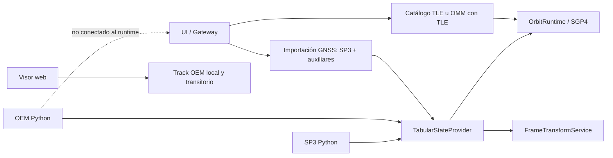

# Visión general de formatos

[Inicio](../index.md) · [Formatos](index.md) · [Estados cartesianos](../engineering/cartesian-states.md) · [Propagación](../propagation/overview.md)

## Matriz de disponibilidad

| Formato | Importación de catálogo/UI | Lector Python de estados | Propagación en runtime | Exportación |
| --- | --- | --- | --- | --- |
| [TLE](tle.md) | Sí. | Carga de catálogo TLE. | Sí, SGP4. | TLE; efemérides CSV/JSON/OEM muestreadas con SGP4. |
| [OMM](omm.md) | Sí, JSON/XML cuando contiene TLE. | No hay lector OMM de estado general. | Sí, como TLE extraído. | OMM JSON/XML mínimo. |
| [OEM](oem.md) | El visor puede cargar un track local temporal; no crea un objeto de catálogo. El gateway solo extrae TLE embebido. | Sí, segmentado e interpolado. | No integrado en `OrbitRuntime`. | Cabecera OEM de catálogo y OEM de efemérides SGP4. |
| [SP3](sp3.md) y [productos GNSS precisos](precise-products.md) | Sí, con SP3 obligatorio; CLK, ERP, SUM, ATT y OSB opcionales/condicionales. | Sí, por satélite e interpolado. | Sí, como efeméride tabulada de runtime; ECI requiere ERP y una ruta de realización válida. | No. |
| [OPM](opm.md), [CPF](cpf.md) y RINEX de observaciones | No. | No. | No. | No. |

## Fronteras de producto

El visor web dispone de una ruta local y transitoria para visualizar un OEM
puro. Esa ruta no registra un objeto de catálogo, no pasa por Gateway/FastAPI
ni entrega una fuente de efemérides a `OrbitRuntime`. En cambio, la importación
de producto GNSS preciso registra una fuente SP3 tabulada por satélite, con
CLK, ERP, SUM, ATT y OSB asociados cuando se aportan. El registro se conserva
en el almacén local de productos precisos y el runtime lo rehidrata al iniciar.
ERP es requisito para ITRF → ECI y, junto a una ruta de realización válida,
habilita esa conversión; sin él, la salida se muestra como **Marco terrestre
aproximado (sin ERP)**. No convierte el producto en un objeto TLE ni descarga
archivos desde el proveedor. Consulte [Productos GNSS precisos](precise-products.md).

## Método de evaluación por formato

Esta tabla es un resumen de consulta de estado, no de la apariencia de una
línea dibujada. La explicación completa de la diferencia entre modelo,
muestreo y reproducción del navegador está en
[Efemérides e interpolación](../orbit-service.md).

| Origen | Método que obtiene el estado | Qué hace el visor con una trayectoria ya muestreada |
| --- | --- | --- |
| TLE / OMM con TLE | SGP4 evalúa directamente cada época. | Une muestras SGP4 con segmentos; el suavizado de tiempo real es sólo visual. |
| SP3 | Lagrange local acotado de grado `min(9, n-1)`, hasta diez nodos, sin extrapolación. | Reproduce linealmente entre las muestras que ya devolvió el backend; no ejecuta Lagrange en el navegador. |
| OEM Python | Respeta `LINEAR`, `LAGRANGE` o `HERMITE` declarados; sin declaración usa lineal. | La carga OEM local del visor es distinta y actualmente reproduce puntos linealmente, sin interpretar la declaración OEM. |
| ERP de un producto GNSS | Interpolación lineal acotada de los parámetros de orientación terrestre. | No es una trayectoria ni mueve por sí solo un satélite. |
| CLK, SUM, ATT/OBX, OSB/BIA | No existe una interpolación orbital implementada. | No generan una trayectoria. |
| OPM | No está soportado. | No aplica. |

## Contrato tabulado común

OEM y SP3 se convierten en `TabularStateProvider`. Sus muestras deben compartir
marco, realización, centro y escala temporal dentro de una serie/segmento; las
épocas son estrictamente crecientes y no pueden duplicarse.

| Interpolación de backend | Disponibilidad |
| --- | --- |
| Lineal | Predeterminada en OEM cuando no existe declaración. |
| Lagrange | OEM declarado, con grado y suficientes muestras; SP3 lo impone localmente con un máximo de grado 9. |
| Hermite | Sólo OEM declarado, grado impar y velocidad en todas las muestras elegidas. |

Las consultas tabuladas fuera de cobertura se rechazan. La covarianza OEM no
se interpola; solo se adjunta a su época de solución exacta. El track OEM
local del navegador no es el `OemStateProvider` Python y no debe anunciarse
como soporte de Hermite o Lagrange.

## Marcos y escalas

Los lectores preservan el origen. Una transformación a ITRF requiere una ruta
del servicio de marcos; una realización IGS no se convierte a ITRF sin una
operación registrada. Las conversiones GPS/TAI/TT/UT1 usan la misma tabla de
segundos intercalares y EOP que el transformador asociado.

Consulte [Sistemas temporales](../engineering/time-systems.md) y
[Marcos de referencia](../engineering/reference-frames.md).

## OCM simplificado

El gateway puede exportar un JSON identificado como OCM que contiene nombre,
identificador, formato de origen y las dos líneas TLE. No existe lector OCM ni
una implementación de todos los perfiles OCM; esa salida no debe anunciarse
como soporte completo del estándar.
