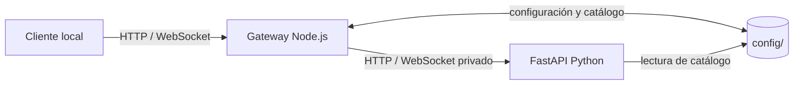

# Integraciones

Las integraciones de Orbit se realizan a través del gateway HTTP de la
aplicación. El proceso Python de propagación es una dependencia privada del
runtime; no debe exponerse ni tratarse como una segunda API pública.

## Interfaces disponibles

| Interfaz | Estado | Uso previsto |
| --- | --- | --- |
| [REST API](rest-api.md) | Disponible localmente | Catálogo, propagación, efemérides, ventanas de visibilidad, exportación y configuración. |
| [WebSocket](websocket.md) | Disponible localmente | Estados y órbitas de las suscripciones activas de un cliente. |
| [OpenAPI](openapi.md) | Disponible localmente | Inspección del contrato FastAPI generado durante la ejecución. |
| [Plugins](plugins.md) | Contrato interno, no distribuible | Módulos ES locales incluidos y revisados junto con el código fuente. |
| [SDK Python](python-sdk.md) | No disponible | No existe paquete, versión ni contrato de compatibilidad de SDK. |
| [CLI](cli.md) | No disponible como producto | Hay scripts operativos y comandos de desarrollo, no una interfaz de línea de comandos pública. |

## Límite de publicación

El gateway se publica por defecto en `127.0.0.1`. No hay autenticación,
autorización, multitenencia, cuotas, claves de API, rate limiting general ni
versionado público formal de la API. Una instancia expuesta fuera de una red
de confianza debe protegerse mediante controles externos adecuados.

Las rutas, los esquemas y los campos de compatibilidad descritos aquí reflejan
la implementación actual. No constituyen una garantía de estabilidad entre
versiones hasta que Orbit publique una política de versionado de API.

## Navegación relacionada

- [Arquitectura](../development/architecture.md)
- [Despliegue](../development/deployment.md)
- [Validación](../development/validation.md)
- [Glosario](../reference/glossary.md)
