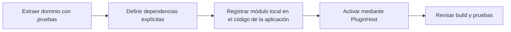

# Plugins

## Estado del sistema de plugins

Orbit contiene una clase interna `PluginHost` para organizar módulos ES locales
que forman parte del código de la aplicación. No existe un sistema de plugins
instalable por usuarios o terceros.

| Capacidad | Estado |
| --- | --- |
| Host de ciclo de vida para módulos ES locales | Implementado en `front/js/plugins/pluginHost.js`. |
| Registro de plugins distribuidos en el runtime actual | No implementado. |
| Manifiesto, marketplace, firma o resolución de dependencias | No implementado. |
| Carga dinámica de código remoto | Deliberadamente no implementada. |
| API de backend para plugins | No publicada. |
| Versionado/compatibilidad de plugins | No definido. |

!!! warning "No es una API de extensión pública"

    `PluginHost` es una utilidad interna de arquitectura. Importar módulos
    internos desde una aplicación externa no crea una integración soportada y
    puede romperse sin aviso de compatibilidad.

## Contrato interno actual

Un módulo local registrado debe aportar un identificador de cadena único y una
función `activate`. `deactivate` es opcional.

```js
export const examplePlugin = {
  id: "orbit.example",
  async activate(context) {
    // Inicialización propiedad del módulo.
  },
  async deactivate() {
    // Liberación de recursos propiedad del módulo.
  }
};
```

| Miembro | Requisito comprobado |
| --- | --- |
| `id` | Cadena no vacía y única dentro del host. Un duplicado produce error. |
| `activate(context)` | Obligatoria; el host la invoca en orden de registro cada vez que se llama a `PluginHost.start()`. |
| `deactivate()` | Opcional; el host la invoca en orden inverso para los plugins que llegaron a activarse. |
| `context` | Objeto arbitrario entregado por el llamador. El host no define ni valida un esquema de servicios. |

El host conserva los plugins activos después de una activación correcta.
`PluginHost.start()` no es idempotente: una llamada posterior vuelve a ejecutar
`activate`. No incluye aislamiento de errores, permisos, sandbox,
serialización de estado ni rollback automático si una activación posterior
falla.

## Reglas de propiedad para código integrado

Las siguientes reglas describen la separación necesaria para convertir una
funcionalidad local en módulo mantenible; no son un mecanismo de instalación:

1. El módulo debe poseer sus entidades Cesium, listeners, nodos de interfaz y
   estado de ciclo de vida.
2. La activación debe recibir dependencias de forma explícita, no buscar estado
   global ni recorrer el DOM fuera de su área de propiedad.
3. La desactivación debe eliminar listeners y recursos creados por el módulo.
4. Los cambios de rutas, claves de configuración y payloads de WebSocket deben
   mantener compatibilidad o documentar su migración.
5. El módulo debe acompañarse de pruebas del comportamiento que extrae.

## Flujo de incorporación interno



La incorporación ocurre en el repositorio y en la imagen de Orbit. No hay
descarga ni ejecución de código de terceros durante el arranque del navegador.

## Límites y trabajo no publicado

No se debe documentar como disponible ninguna de las siguientes capacidades:

- Instalar un paquete mediante UI, npm, pip o CLI de Orbit.
- Resolver plugins desde Internet, un registro privado o un directorio de
  usuario.
- Conceder permisos por plugin o aislarlo del proceso del navegador.
- Añadir rutas FastAPI/Node, modelos de propagación o transformaciones de
  marcos desde un plugin externo.
- Cargar versiones independientes de Cesium, React o las dependencias de
  runtime.

## Referencias relacionadas

- [Arquitectura](../development/architecture.md)
- [Contribuir](../development/contributing.md)
- [Validación](../development/validation.md)
