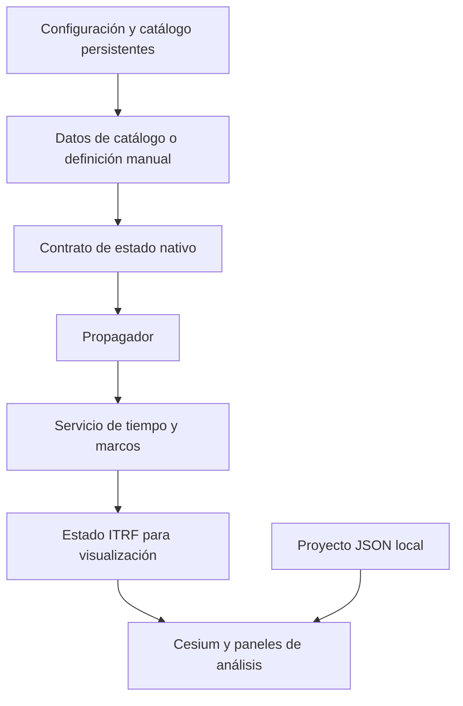

# Introducción a Orbit

[Inicio](../index.md){ .md-button }

Orbit integra visualización orbital, catálogo de elementos, propagación,
proyectos locales y análisis operativo en un runtime local compuesto por un
cliente 3D, un gateway y una API de cálculo. El sistema está diseñado para
mantener un límite claro entre los datos de entrada, el modelo numérico que
los interpreta y la representación utilizada por la interfaz.

## Propósito

Orbit proporciona una superficie de trabajo visual para operaciones y análisis
con TLE, OMM con TLE y órbitas manuales. El producto expone los metadatos que
condicionan un resultado orbital: época, escala temporal, marco de referencia,
realización terrestre, unidades y procedencia de los datos de orientación de
la Tierra.

La plataforma no sustituye a un sistema de determinación de órbita, una cadena
de navegación operacional ni un entorno de análisis de misión de alta
fidelidad. Sus modelos y sus interfaces se documentan con sus límites para que
una visualización no se interprete como una validación científica.

## Arquitectura funcional

El contrato de estado nativo evita que la interfaz renombre implícitamente un
marco genérico. Un TLE se propaga en TEME; una órbita manual se documenta como
EME2000; la conversión a ITRF se realiza mediante una ruta explícita y datos
EOP cuando están disponibles.

## Límites de producto

| Área | Estado |
| --- | --- |
| Propagación SGP4 de catálogo | Disponible. |
| Órbitas manuales de dos cuerpos y Cowell/RK4 | Disponibles en `EME2000`. |
| Ajuste o exportación de TLE sintético desde una efeméride manual | No disponible; requerirá un ajuste SGP4 explícito, no una conversión directa. |
| Visor 3D, capas, proyectos locales y estaciones de tierra | Disponible. |
| Lectores Python SP3/OEM de precisión | Disponibles como biblioteca; no integrados como carga de producto. |
| Determinación de órbita, medidas, maniobras, conjunciones y Monte Carlo | No disponibles. |
| SDK público, CLI de producto, plugins instalables y colaboración | No disponibles. |

## Navegación

- [Primeros pasos](../getting-started/installation.md): instalación local,
  requisitos y arranque.
- [Guía de usuario](../user-guide/index.md): proyectos, capas, visualización,
  tiempo, estaciones e intercambio de datos.
- [Ingeniería](../engineering/index.md): contratos científicos y de software.
- [Propagación](../propagation/index.md): modelos, fuerzas y precisión.
- [Operación](../operations/index.md): configuración y datos EOP locales.
- [Guía de desarrollo](../development/index.md): arquitectura y pruebas.

## Convenciones de lectura

Las páginas de ingeniería usan SI salvo que el formato de entrada exija otra
unidad. Las páginas de formatos declaran la unidad original y el punto donde se
normaliza. Las páginas que describen una capacidad ausente utilizan el estado
**No disponible** y no definen una interfaz futura.

## Referencias relacionadas

- [Marcos de referencia](../engineering/reference-frames.md)
- [Sistemas temporales](../engineering/time-systems.md)
- [Propagación](../propagation/overview.md)
- [Arquitectura](../development/architecture.md)
