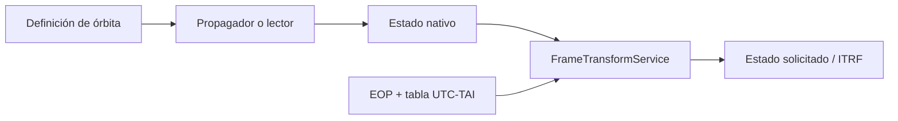

# Visión general de propagación

[Inicio](../index.md) · [Propagación](index.md) · [Estados cartesianos](../engineering/cartesian-states.md) · [Marcos](../engineering/reference-frames.md)

## Contrato común

Los propagadores modernos exponen primero `native_state_at(instant)` y después
`state_at(instant, target_frame=...)`. El primer método conserva el marco y la
escala propios del modelo; el segundo delega el cambio de marco en el servicio
común de transformación.

Los métodos que devuelven seis números (`propagate_datetime`, `propagate` y
`propagate_offset`) permanecen como adaptadores del renderer y devuelven el
estado ITRF en unidades SI. No deben usarse para deducir el marco nativo.

## Propagadores disponibles

Un propagador define cómo evoluciona el estado. Los términos como J2, J3, J4 y
arrastre son [modelos de fuerza](force-models.md), no propagadores: Cowell los
compone y el integrador [RK4](rk4.md) resuelve el sistema numérico.

| Propagador | Origen | Estado nativo | Dinámica | Disponibilidad operativa |
| --- | --- | --- | --- | --- |
| [SGP4](sgp4.md) | TLE | TEME, UTC | Implementación SGP4 de `sgp4.api.Satrec`. | Sólo catálogo TLE. |
| [Dos cuerpos](two-body.md) | Elementos manuales | EME2000, UTC | Kepler elíptico analítico. | Órbita manual. |
| [Cowell](cowell.md) | Estado manual | EME2000, UTC | RK4 fijo, central/J2/J3/J4/drag. | Órbita manual. |
| J2+J3+J4 | Estado manual | EME2000, UTC | Preset RK4 fijo sin drag. | Compatibilidad manual. |

El registro de propagadores usado por el catálogo contiene solo `sgp4`. No hay
selector de Cowell, dos cuerpos ni J2 para un objeto de catálogo TLE.

## Marcos y unidades

| Origen | Marco nativo | Unidades internas | Salida de contrato |
| --- | --- | --- | --- |
| SGP4 | TEME | km, km/s | `StateVector` SI. |
| Dos cuerpos | EME2000 | km, km/s | `StateVector` SI. |
| Cowell/J2+J3+J4 | EME2000 | km, km/s | `StateVector` SI. |

La transformación a ITRF depende de los datos de orientación terrestre. Una
configuración visual sin EOP local deja la procedencia marcada como aproximada;
el modo estricto se describe en [Marcos de referencia](../engineering/reference-frames.md).

## Selección manual

Las rutas manuales aceptan elementos keplerianos para dos cuerpos, un estado
cartesiano para Cowell y el preset J2+J3+J4 de compatibilidad. La entrada y la
dinámica de esos modelos se definen en `EME2000`; si la vista o una efeméride
de salida necesita un marco terrestre, se transforma después a `ITRF`.

SGP4 no participa en esta selección. Consume un TLE de catálogo y mantiene
`TEME` como su marco nativo; reutilizar elementos manuales EME2000 como si
fueran elementos medios NORAD no es una conversión de marco válida.

!!! warning "No disponible: ajuste de TLE sintético"

    Exportar un TLE a partir de una órbita manual requerirá una operación
    explícita de ajuste: muestrear una efeméride de referencia, expresarla en
    TEME y ajustar el modelo SGP4/TLE sobre un intervalo, declarando residuos
    y procedencia. No forma parte de la propagación manual actual.

## Límites globales

- No hay determinación de órbita, estimación de parámetros, maniobras ni
  propagación de covarianza.
- No hay integrador adaptativo, eventos de precisión, terceros cuerpos, SRP,
  relatividad ni geopotencial completo.
- El lector OEM/SP3 es una fuente tabulada Python; no es un propagador
  registrado en `OrbitRuntime` ni una carga de producto UI/API.

Consulte [Formatos](../formats/index.md) para fuentes de datos,
[Integradores numéricos](numerical-integrators.md) para RK4 y
[Modelos de fuerza](force-models.md) para las fuerzas disponibles.
