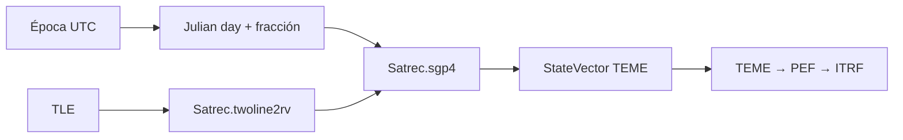

# SGP4

[Inicio](../index.md) · [Propagación](index.md) · [TLE](../formats/tle.md) · [Marcos de referencia](../engineering/reference-frames.md)

## Propósito

`SGP4Propagator` propaga un juego de dos líneas mediante `sgp4.api.Satrec`.
Es el motor registrado por defecto para los objetos del catálogo y conserva
que el estado nativo de SGP4 está expresado en `TEME`.

## Entrada y salida

| Aspecto | Contrato |
| --- | --- |
| Entrada | Dos líneas TLE válidas para `Satrec.twoline2rv`. |
| Época de consulta | UTC; se emplea para construir la fecha juliana de SGP4. |
| Estado nativo | Posición km y velocidad km/s de SGP4, convertidas a SI en `StateVector`. |
| Marco nativo | `TEME`. |
| Salida de renderer | ITRF solicitado a través de `FrameTransformService`. |
| Procedencia | `source=TLE`, `propagator=sgp4`, `native_frame=TEME`. |

## Flujo de cálculo

Si SGP4 devuelve un código de error, `native_state_at` falla por defecto. El
modo interno no estricto conserva una advertencia de compatibilidad, pero no
es el contrato recomendado para una aplicación científica.

## Tiempo y marco

La producción SGP4 usa la época UTC de consulta. Para la salida terrestre, la
ruta TEME usa la rotación GMST compatible con el modelo y movimiento polar.
Un valor de DUT1 legado puede inyectarse en el constructor, pero el camino
recomendado es un proveedor EOP versionado en el transformador compartido.

No debe etiquetarse un estado TEME como GCRF, EME2000 o ECI. Véase
[Marcos de referencia](../engineering/reference-frames.md).

## Uso manual

La interfaz de órbitas manuales puede seleccionar SGP4 mediante un TLE
sintético generado desde sus campos. Esa ruta es útil para comparar la salida
operativa de SGP4; no convierte los elementos manuales en un modelo físico
equivalente a dos cuerpos, J2 o Cowell.

## Precisión y limitaciones

- La fidelidad depende de la calidad, época y régimen de uso del TLE de
  origen; Orbit no reconstruye un historial de TLE ni ajusta sus parámetros.
- No hay selección de fuerzas, arrastre configurable, covarianza propagada ni
  eventos asociados a SGP4.
- El endpoint de exportación de efemérides del catálogo acepta actualmente
  solo `sgp4`.
- La transformación TEME→ITRF está condicionada por la política EOP; el
  fallback visual está marcado como aproximado.

Para el formato de entrada y sus validaciones, consulte [TLE](../formats/tle.md).
