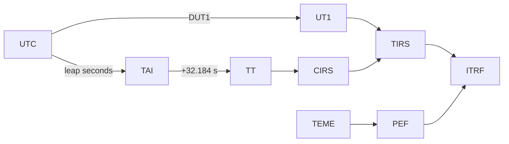

# Apéndice

## Contratos operativos resumidos

Este apéndice consolida reglas que afectan a resultados, integraciones y
operación. No reemplaza la especificación de cada endpoint o módulo.

## Unidades y estados

| Elemento | Contrato |
| --- | --- |
| Posición interna `StateVector` | metros (m). |
| Velocidad interna `StateVector` | metros por segundo (m/s). |
| Aceleración interna `StateVector` | metros por segundo cuadrado (m/s²). |
| Covarianza | Matriz cartesiana 6×6 si está disponible. |
| Entradas manuales keplerianas | Semieje mayor en km; ángulos en grados. |
| Entradas manuales cartesianas | Posición en km; velocidad en km/s. |
| Estado WebSocket/renderizado | ITRF, posición en m y velocidad en m/s. |
| Elementos osculadores de inspector | Estado y elementos expresados en km, km/s y grados según el campo. |

Una unidad no debe inferirse por el nombre de una propiedad cuando la respuesta
incluye una declaración explícita de unidades.

## Cadena de tiempo y marcos

| Fuente | Marco nativo | Transformación de salida |
| --- | --- | --- |
| TLE / SGP4 | TEME | TEME→PEF→ITRF. |
| Manual de dos cuerpos | EME2000 | EME2000→CIRS→TIRS→ITRF. |
| Manual Cowell/RK4 | EME2000 | EME2000→CIRS→TIRS→ITRF. |
| OEM/SP3 tabular | Declarado por el producto. | Sólo cuando hay transformación soportada y metadatos suficientes. |

La implementación no acepta `ECI` ni `ECEF` como etiquetas de marco nuevas.
ITRF es una familia de realizaciones; una realización concreta se conserva o
se declara explícitamente cuando la operación la requiere.

## Políticas EOP y leap seconds

| Modo | Comportamiento |
| --- | --- |
| Visual aproximado | Puede operar sin snapshot EOP local; las transformaciones se marcan como aproximadas. No es apropiado para un resultado que requiera trazabilidad de precisión. |
| EOP configurado | Carga un C04 local, conserva identidad de fuente/snapshot y aplica su cobertura según la política. |
| EOP estricto | Requiere C04 local, configuración compatible, tabla local UTC–TAI, datos vigentes y cobertura del intervalo. Rechaza extrapolación. |

Variables clave:

| Variable | Función |
| --- | --- |
| `ORBIT_EOP_C04_PATH` | Ruta del snapshot C04 local en el proceso/contenedor. |
| `ORBIT_EOP_C04_SHA256` | Hash esperado del fichero C04. |
| `ORBIT_EOP_STRICT` | Activa requisitos estrictos de EOP y leap seconds. |
| `ORBIT_EOP_REQUIRED_START` / `ORBIT_EOP_REQUIRED_END` | Ventana operativa que debe estar cubierta por C04 y tabla UTC–TAI. |
| `ORBIT_LEAP_SECONDS_PATH` | Ruta de la tabla local `leap-seconds.list`. |
| `ORBIT_LEAP_SECONDS_SHA256` | Hash esperado de la tabla de leap seconds. |
| `ORBIT_TERRESTRIAL_REALIZATION` | Realización terrestre de salida controlada. |
| `ORBIT_ENABLE_IGS20_FAMILY_ITRF2020_ALIGNMENT` | Activa la alineación global opcional IGS20/IGb20/IGc20↔ITRF2020 para estados orbitales de satélite; requiere `ORBIT_TERRESTRIAL_REALIZATION=ITRF2020`. |
| `ORBIT_ENABLE_IGS20_ITRF2020_ALIGNMENT` | Política histórica exacta sólo para IGS20; es mutuamente excluyente con la política de familia. |

Las rutas se configuran dentro del entorno que ejecuta Orbit. Con Compose, los
ficheros montados en `./config` se ven normalmente bajo `/app/config`.

## Límites de recursos actuales

| Recurso | Límite o política |
| --- | --- |
| Cuerpo JSON del gateway | 25 MB. |
| Timeout de proxy Python | 30 s. |
| Handshake WebSocket | 10 s. |
| Muestras de órbita API | 2–7200. |
| Horizonte de órbita API | 0,1–8760 h. |
| Serie de efeméride | Hasta 20 000 puntos; paso > 0 y ≤ 3600 s. |
| Parámetros orbitales | 2–2000 muestras; presupuesto adicional para rutas RK4. |
| Caché de órbitas runtime | TTL 10 s. |
| Caché de efemérides | LRU 256, TTL 120 s. |
| Estado WebSocket | Intervalo predeterminado de 1 s. |
| Órbitas WebSocket | Intervalo predeterminado de 10 s si la órbita futura está habilitada. |

Estos valores son límites de implementación presentes, no una garantía de
throughput o latencia de producción.

## Resumen de errores HTTP

| Situación | Resultado típico |
| --- | --- |
| JSON malformado en gateway | `400`. |
| JSON que excede el límite del gateway | `413`. |
| Forma o valor incompatible con modelo FastAPI | `422`. |
| Satélite/entrada no encontrada | `404` en las rutas que lo resuelven explícitamente. |
| Backend Python no accesible desde gateway | `502`. |
| Gateway iniciado pero backend no disponible | `GET /health` devuelve `503`. |
| Configuración/catálogo persistido sin recarga efectiva | `503` con indicación de persistencia en las rutas que lo informan. |

No todos los errores comparten una envoltura JSON única. Los clientes deben
interpretar estado HTTP, tipo de contenido y cuerpo de la ruta concreta.

## Lista de comprobación de reproducibilidad

Antes de comparar o exportar un resultado orbital:

1. Registrar la versión/commit de Orbit.
2. Registrar TLE, estado inicial, OEM/SP3 o entrada exacta de catálogo.
3. Registrar propagador, términos de fuerza, paso y rango.
4. Registrar marcos, realización terrestre, escala temporal y unidades.
5. Registrar snapshot EOP, hash y tabla de segundos intercalares si intervienen.
6. Confirmar que el intervalo está dentro de la cobertura configurada.
7. Registrar si la ruta usó el modo visual aproximado.
8. Conservar la respuesta completa, no sólo posiciones redondeadas.

## Referencias relacionadas

- [Glosario](glossary.md)
- [Bibliografía](bibliography.md)
- [REST API](../integrations/rest-api.md)
- [Despliegue](../development/deployment.md)
- [Validación](../development/validation.md)
