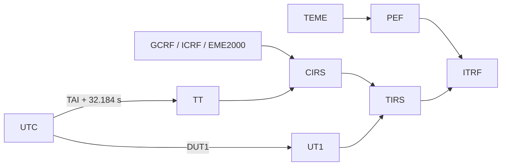

# Glosario

## Alcance

Este glosario usa la terminología que aparece en los contratos implementados de
Orbit. Las definiciones de referencia geodésica y temporal se complementan con
las fuentes de [Bibliografía](bibliography.md).

!!! note "Convención de precisión"

    Un acrónimo no sustituye los metadatos. Un estado usable debe declarar al
    menos época, escala temporal, marco, centro y unidades. Cuando aplique,
    debe declarar también realización terrestre y procedencia de EOP.

## Tiempo y orientación terrestre

| Término | Definición en Orbit |
| --- | --- |
| **UTC** | Escala de tiempo civil utilizada en las rutas HTTP y en la mayoría de entradas de usuario. Las fechas se deben enviar con zona horaria. |
| **TAI** | Tiempo Atómico Internacional. Orbit puede convertir UTC↔TAI con una tabla de segundos intercalares. |
| **TT** | Tiempo Terrestre. Se obtiene desde TAI añadiendo 32,184 s y participa en la cadena celeste de alta precisión. |
| **UT1** | Escala ligada a la rotación de la Tierra. Orbit la obtiene de UTC mediante DUT1 cuando existe un proveedor EOP apropiado. |
| **DUT1** | Diferencia UT1−UTC incluida en los productos EOP. Es necesaria para una relación explícita entre UTC y la rotación terrestre. |
| **Segundo intercalar** | Ajuste que relaciona UTC con TAI. Orbit puede cargar una tabla local con hash, cobertura y fecha de caducidad declarada. |
| **EOP** | Earth Orientation Parameters. Conjunto de parámetros de orientación terrestre, entre ellos DUT1 y movimiento polar. |
| **IERS C04** | Producto tabular de EOP del IERS. En el modo estricto de Orbit se usa un snapshot local identificado, no una descarga durante la transformación. |
| **dX, dY** | Correcciones de las coordenadas del polo celeste respecto al modelo IAU 2000A. Orbit valida C04 con estas columnas; no acepta el encabezado legado dPsi/dEps para ese contrato. |
| **xp, yp** | Componentes del movimiento polar. Participan en la transformación TIRS/PEF→ITRF. |
| **GMST** | Greenwich Mean Sidereal Time. Es una cantidad de rotación; Orbit la reconoce como etiqueta de escala, pero no como escala temporal intercambiable automáticamente. |
| **Escala temporal** | Etiqueta que define cómo interpretar una época. Orbit reconoce UTC, TAI, TT, UT1, GPS, GAL, QZS, BDT, GLO y otras etiquetas que no convierte automáticamente. |

## Marcos y realizaciones

| Término | Definición en Orbit |
| --- | --- |
| **StateVector** | Contrato cartesiano de Orbit con época, escala, marco, realización, centro, posición SI y campos opcionales de velocidad, aceleración, covarianza y procedencia. |
| **TEME** | True Equator Mean Equinox. Marco nativo de los estados propagados con SGP4 en Orbit. |
| **EME2000** | Marco ecuatorial medio de J2000 empleado como marco nativo de las órbitas manuales de dos cuerpos y Cowell. |
| **GCRF** | Geocentric Celestial Reference Frame. Marco celeste geocéntrico explícito admitido por el servicio de transformaciones. |
| **ICRF** | International Celestial Reference Frame. Realización del ICRS; Orbit lo conserva como marco explícito. |
| **CIRS** | Celestial Intermediate Reference System. Marco intermedio de la ruta celeste basada en precesión-nutación. |
| **TIRS** | Terrestrial Intermediate Reference System. Marco terrestre intermedio antes del movimiento polar. |
| **PEF** | Pseudo-Earth Fixed. Marco intermedio utilizado en la ruta TEME→PEF→ITRF. |
| **ITRS** | International Terrestrial Reference System, sistema de referencia terrestre conceptual. |
| **ITRF** | International Terrestrial Reference Frame. La denominación agrupa una familia o serie de realizaciones del ITRS; ITRF2020 es una realización concreta. En Orbit puede ser necesario declarar la realización específica. |
| **IGS20** | Realización IGS relacionada con ITRF2020. Orbit sólo habilita el alineamiento global IGS20↔ITRF2020 mediante configuración explícita. |
| **IGb20 / IGc20** | Realizaciones IGS cuyo identificador se conserva; Orbit no les aplica una conversión implícita hacia ITRF2020. |
| **Realización terrestre** | Implementación concreta de un sistema terrestre, con época y convenciones propias. No debe sustituirse por la etiqueta genérica ITRF. |
| **ECI / ECEF** | Etiquetas genéricas ambiguas. `StateVector` las rechaza porque no identifican modelo, realización o ruta de transformación suficientes. |

La reducción terrestre implementada distingue dos rutas:

## Propagación y estados

| Término | Definición en Orbit |
| --- | --- |
| **Propagador** | Motor que obtiene un estado a partir de una definición y una época. |
| **SGP4** | Modelo usado para entradas TLE. Su estado nativo es TEME. |
| **Dos cuerpos** | Propagador analítico manual con gravedad central idealizada y estado nativo EME2000. |
| **Cowell/RK4** | Propagador manual numérico de paso fijo. Admite gravedad central, J2/J3/J4 y drag exponencial como términos seleccionables; el integrador publicado es RK4. |
| **J2 / J2-J3-J4 heredados** | Rutas conservadas para proyectos existentes. No son familias seleccionables nuevas al mismo nivel que Cowell/RK4. |
| **TLE** | Two-Line Element set. Representación de catálogo usada por SGP4. |
| **BSTAR** | Término de arrastre incluido en un TLE/SGP4. Orbit no admite drag manual adicional en una órbita manual SGP4. |
| **Efeméride** | Serie de estados o puntos muestreados en un intervalo. La API limita la serie a 20 000 puntos. |
| **Estado osculador** | Elementos instantáneos derivados de un vector de estado bajo el modelo de dos cuerpos para inspección. No son una determinación de órbita. |
| **AOS / LOS** | Acquisition Of Signal / Loss Of Signal; comienzo y fin de una ventana de visibilidad. Orbit los extrae a partir de muestras de elevación. |
| **Caché TTL/LRU** | Almacenamiento temporal con caducidad y límite de capacidad. Orbit usa TTL para órbitas y LRU/TTL para efemérides. |

## Formatos y datos

| Término | Definición en Orbit |
| --- | --- |
| **OMM** | Orbit Mean-Elements Message de la familia ODM. Orbit importa OMM JSON/XML cuando contiene los datos TLE necesarios y puede exportar una representación limitada. |
| **OEM** | Orbit Ephemeris Message. Orbit contiene un lector Python segmentado y puede generar exportaciones simplificadas; la carga de un OEM de alta fidelidad no es una ruta pública de UI/REST. |
| **OCM** | Orbit Comprehensive Message. Orbit genera una salida JSON simplificada; no declara cobertura completa del estándar. |
| **SP3** | Formato de órbitas y relojes GNSS. Existe un lector Python con metadatos de estado; no se publica importación SP3 por UI, gateway o API. |
| **Covarianza** | Matriz 6×6 de incertidumbre cartesiana cuando la fuente la proporciona. Orbit conserva covarianza OEM cartesiana; no acepta bloques RTN/RSW/TNW. |
| **Interpolación Lagrange** | Interpolación polinómica sobre muestras tabulares. El grado requiere un número correspondiente de puntos. |
| **Interpolación Hermite** | Interpolación que usa posición y velocidad; en el lector OEM exige grado impar y número de muestras compatible. |
| **Provenance / procedencia** | Metadatos que identifican fuente, versión, calidad o snapshot de datos usados en un estado/transformación. |

## Runtime e integraciones

| Término | Definición en Orbit |
| --- | --- |
| **Gateway** | Proceso Node.js publicado que sirve la interfaz y media el acceso al backend Python. |
| **Backend Python** | Proceso FastAPI privado para cálculo orbital y WebSocket. |
| **OpenAPI** | Documento generado por FastAPI en `/openapi.json` y publicado por el gateway. No describe por completo las rutas propias Node. |
| **WebSocket** | Canal `/ws` de snapshots de catálogo, estado y órbitas para suscripciones de un cliente. |
| **PluginHost** | Utilidad interna de ciclo de vida para módulos ES locales. No es un sistema de plugins distribuibles. |
| **Modo EOP estricto** | Política que exige snapshots locales y cobertura/identidad adecuadas en transformaciones dependientes de orientación terrestre. |

## Referencias relacionadas

- [Apéndice](appendix.md)
- [REST API](../integrations/rest-api.md)
- [Validación](../development/validation.md)
- [Bibliografía](bibliography.md)
