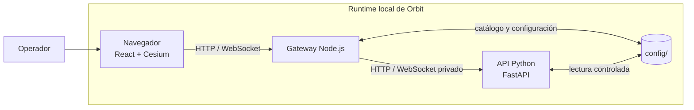
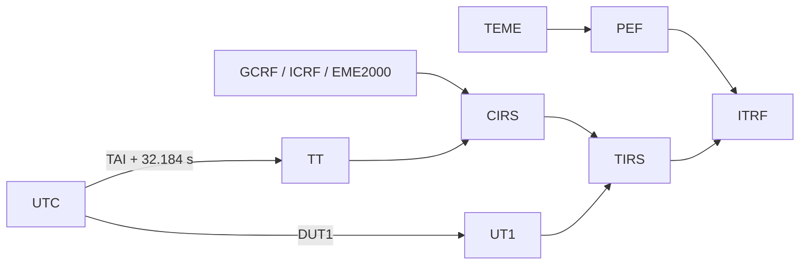

# Documentación de Orbit

Orbit es una plataforma local de visualización, catálogo y propagación orbital
orientada a elementos TLE, órbitas manuales y análisis operativo interactivo.
Combina un visor 3D basado en Cesium, un gateway de aplicación y un servicio
de cálculo Python para mantener separadas la experiencia de trabajo, la
persistencia de datos y los contratos numéricos.

La plataforma prioriza contratos explícitos de tiempo, marco de referencia,
unidades y procedencia. Una visualización o una efeméride no debe adquirir un
marco, una escala temporal o una realización terrestre por inferencia.

!!! warning "Alcance de la documentación"

    Esta raíz contiene la documentación pública de Orbit. Cada página describe
    el comportamiento verificable del código actual y declara sus límites. Las
    capacidades no implementadas se documentan explícitamente como tales; una
    ruta de navegación no implica una interfaz futura ni una promesa de
    producto.

## Plataforma

| Dominio | Responsabilidad actual | Interfaz principal |
| --- | --- | --- |
| Espacio de trabajo | Visualización 3D, capas, proyectos locales, estaciones de tierra y control temporal. | React/Vite, Cesium y módulos del cliente. |
| Gateway de aplicación | Archivos estáticos, catálogo persistente, importación, exportación y proxy del backend. | HTTP y WebSocket del mismo origen. |
| Servicio orbital | Propagación, efemérides, parámetros orbitales, visibilidad y contratos de tiempo/marco. | FastAPI interno. |
| Datos persistentes | Configuración de la aplicación y catálogos editables por el operador. | Directorio `config/` montado como volumen. |

El gateway es el único extremo expuesto por defecto. El proceso Python se
ejecuta como dependencia privada del runtime y no constituye una segunda API
pública independiente del gateway.

## Capacidades disponibles

| Área | Alcance disponible | Límites operativos relevantes |
| --- | --- | --- |
| Visualización 3D | Tierra, Sol, Luna, estrellas, mapas base, cámaras, selección de objetos y grabación local del canvas. | La grabación se realiza en el navegador mediante `MediaRecorder`; no es un servicio de grabación del backend. |
| Espacio de trabajo | Árbol de capas con carpetas anidadas, visibilidad, acciones de contexto, duplicados, cuerpos y estaciones. | El estado de trabajo se conserva localmente; no existe colaboración multiusuario. |
| Proyectos | Documentos JSON locales con capas, estado temporal, órbitas manuales y estaciones. | Las muestras OEM locales no se restauran de forma fiable al reabrir un proyecto. |
| Tiempo | Modos estático, tiempo real con pausa y rango simulado; línea temporal, scrubber, velocidad y reinicio. | No es un replay histórico de TLE ni una simulación física distribuida. |
| Catálogo | Búsqueda, filtros, paginación, importación TLE y OMM JSON/XML con TLE, refresco remoto controlado y persistencia local. | No existe autenticación, autorización, multitenencia ni control de acceso por usuario. |
| Propagación de catálogo | SGP4 con estado nativo TEME y salida transformada para visualización. | El registro predeterminado de satélites de catálogo no ofrece un selector de propagador alternativo. |
| Órbitas manuales | Dos cuerpos analítico, SGP4 mediante TLE sintético y Cowell RK4. | Las órbitas manuales son transitorias y no equivalen a un sistema de determinación de órbita. |
| Estaciones de tierra | Máscara de elevación, AOS/LOS, footprint, heatmap visual y presupuesto de enlace simplificado. | AOS/LOS se obtiene mediante muestreo por paso; no emplea búsqueda de raíces de alta precisión. |
| Exportación | TLE, OMM JSON/XML, OCM simplificado, OEM de cabecera y efemérides SGP4 en CSV, JSON u OEM. | Las salidas OMM, OCM y OEM no deben interpretarse como cobertura completa de todos los perfiles de sus estándares. |
| API | REST, WebSocket, OpenAPI/Swagger y ReDoc. | No hay versión pública formal de API, SDK distribuido ni CLI de producto. |

## Propagación y modelos dinámicos

Orbit distingue el origen del estado de su representación para visualización.
El propagador conserva un marco nativo explícito y el servicio de marcos
realiza la transformación solicitada.

| Origen | Marco nativo | Modelo | Uso previsto |
| --- | --- | --- | --- |
| TLE de catálogo | TEME | SGP4 | Seguimiento y visualización de objetos definidos por TLE. |
| Órbita manual de dos cuerpos | EME2000 | Kepleriano analítico | Diseño y exploración de una órbita idealizada. |
| Órbita manual SGP4 | TEME | SGP4 mediante TLE sintético | Comparación operativa con una definición TLE generada. |
| Órbita manual Cowell | EME2000 | RK4 de paso fijo; gravedad central, J2/J3/J4 y drag exponencial opcional | Estudios de sensibilidad y trayectorias manuales de alcance limitado. |

!!! warning "Fidelidad de los modelos"

    Cowell no constituye un propagador de alta fidelidad para determinación de
    órbita, análisis de incertidumbre o validación de misión. No incluye
    terceros cuerpos, presión de radiación solar, relatividad, geopotencial
    completo, meteorología espacial, integradores adaptativos ni propagación
    de covarianza.

Las rutas históricas J2 y J2-J3-J4 se mantienen para compatibilidad con
proyectos existentes. No deben presentarse como familias nuevas de modelos sin
documentar antes sus contratos y sus criterios de selección.

## Tiempo, marcos y unidades

El contrato común de estado es `StateVector`. Cada estado declara como mínimo
su época, escala temporal, marco, realización terrestre, centro y posición.
Las velocidades, aceleraciones, covarianzas y datos de procedencia se
conservan cuando están disponibles.

| Elemento | Contrato de Orbit |
| --- | --- |
| Unidades cartesianas | SI: metros, metros por segundo y metros por segundo cuadrado. |
| Marcos inerciales | TEME, EME2000, GCRF e ICRF. |
| Marcos intermedios y terrestres | CIRS, TIRS, PEF e ITRF. |
| Etiquetas rechazadas | `ECI` y `ECEF` genéricos, porque no identifican un modelo de transformación suficiente. |
| Escalas convertibles | UTC, TAI, TT, UT1, GPS, GAL, QZS, BDT y GLO, sujeto a los datos requeridos. |
| Escalas reconocidas sin conversión automática | TDB, TCB, TCG, IRN, MET, MRT, SCLK y GMST. |

La reducción terrestre sigue rutas explícitas:

Los productos EOP locales IERS C04 proporcionan DUT1, movimiento polar y
correcciones del polo celeste. En modo estricto, Orbit exige una tabla EOP
local identificada y una tabla local de segundos intercalares vigente. El modo
visual sin esos datos queda marcado como aproximado y no es apropiado para
análisis o exportación de precisión.

!!! note "Realizaciones terrestres"

    ITRF designa una familia de realizaciones; no es sinónimo de cualquier
    sistema terrestre. La conversión global IGS20 a ITRF2020 se habilita de
    forma explícita y solo para estados orbitales geocéntricos. Las
    realizaciones IGb20 e IGc20 se preservan sin conversión implícita. Las
    correcciones de estación o antena no se infieren a partir de esa operación
    global.

## Formatos y efemérides

| Formato o fuente | Estado actual | Observaciones de contrato |
| --- | --- | --- |
| TLE | Importación, catálogo, SGP4 y exportación disponibles. | El estado propagado nativo es TEME. |
| OMM | Importación JSON/XML cuando contiene TLE y exportación JSON/XML disponibles. | La cobertura depende de los campos necesarios para construir el objeto de catálogo. |
| OEM | El visor puede cargar una trayectoria OEM tabulada local. | Un OEM puro no entra como objeto de catálogo; esa ruta de navegador no garantiza la transformación de un OEM TEME/GCRF arbitrario mediante el servicio de marcos. |
| SP3 | Existe un lector Python de posiciones y velocidades con metadatos nativos. | No existe importación SP3 mediante la UI, gateway, API pública ni `OrbitRuntime`. |
| OEM de precisión | Existe un lector Python segmentado con interpolación lineal, Lagrange y Hermite; OEM 2 puede conservar aceleración y covarianza cartesiana por época. | No existe carga operativa de ese proveedor desde la UI o la API pública. |
| OPM, CPF y RINEX | No disponibles. | No deben declararse como formatos admitidos. |

## Límites explícitos de producto

Las siguientes capacidades no forman parte del producto actual y no deben
inferirse de la arquitectura extensible de Orbit:

- Determinación de órbita, observaciones, tracking de medidas, filtros de
  Kalman y ajuste de estados.
- Maniobras, conjunciones, reentrada, Monte Carlo, constelaciones Walker y
  optimización de flotas.
- Análisis estadístico de flotas, propagación de incertidumbre y elipsoides de
  covarianza visualizados.
- Presión de radiación solar, terceros cuerpos, relatividad, modelos
  atmosféricos de alta fidelidad y geopotenciales completos.
- SDK Python distribuido, CLI de producto, instalación de plugins, usuarios,
  autenticación, autorización, almacenamiento remoto de proyectos o
  colaboración en tiempo real.

No existe actualmente un host de plugins en Orbit. La modularidad del código
fuente no crea una API de extensiones ni permite registrar paquetes de terceros.
Consulte la [hoja de ruta de plugins](../integrations/plugins.md) para los
requisitos de una futura arquitectura de extensibilidad.

## Mapa documental

La navegación separa la operación del producto, los contratos científicos, la
integración y el desarrollo. Cada área dispone de una página índice y enlaza a
sus artículos específicos.

| Área | Punto de entrada | Contenido relacionado |
| --- | --- | --- |
| Introducción | [Visión general](introduction/overview.md) | Propósito, alcance y convenciones. |
| Primeros pasos | [Instalación](getting-started/installation.md) | [Requisitos](getting-started/requirements.md) · [Inicio rápido](getting-started/quick-start.md) |
| Guía de usuario | [Índice de usuario](user-guide/index.md) | [Proyectos](user-guide/projects.md) · [Espacio de trabajo](user-guide/workspace.md) · [Capas](user-guide/layers.md) · [Línea temporal](user-guide/timeline.md) |
| Ingeniería | [Índice de ingeniería](engineering/index.md) | [Estados cartesianos](engineering/cartesian-states.md) · [Marcos](engineering/reference-frames.md) · [Tiempo](engineering/time-systems.md) |
| Formatos espaciales | [Índice de formatos](formats/index.md) | [TLE](formats/tle.md) · [OMM](formats/omm.md) · [OEM](formats/oem.md) · [SP3](formats/sp3.md) |
| Propagación | [Índice de propagación](propagation/index.md) | [SGP4](propagation/sgp4.md) · [Dos cuerpos](propagation/two-body.md) · [Cowell](propagation/cowell.md) · [Fuerzas](propagation/force-models.md) |
| Análisis | [Índice de análisis](analysis/index.md) | [Gráficas](analysis/plots.md) · [Eventos](analysis/events.md) · [Determinación de órbita](analysis/orbit-determination.md) |
| Integraciones | [Índice de integraciones](integrations/index.md) | [REST API](integrations/rest-api.md) · [WebSocket](integrations/websocket.md) · [Plugins](integrations/plugins.md) |
| Operación | [Índice de operación](operations/index.md) | [Configuración](operations/configuration.md) · [Tiempo, EOP e ITRF](operations/time-eop.md) · [Validación](operations/validation.md) |
| Desarrollo | [Índice de desarrollo](development/index.md) | [Arquitectura](development/architecture.md) · [Pruebas](development/testing.md) · [Contribución](development/contributing.md) |
| Referencia | [Índice de referencia](reference/index.md) | [Glosario](reference/glossary.md) · [Bibliografía](reference/bibliography.md) · [Apéndice](reference/appendix.md) |

## Audiencias y rutas de lectura

| Audiencia | Información prioritaria | Áreas documentales |
| --- | --- | --- |
| Operadores | Instalación local, configuración, catálogo, datos EOP, registros y recuperación. | [Primeros pasos](getting-started/installation.md) · [Operación](operations/index.md) · [Referencia](reference/index.md) |
| Analistas de misión | Representación orbital, marcos, escalas temporales, modelos, precisión y límites. | [Ingeniería](engineering/index.md) · [Formatos](formats/index.md) · [Propagación](propagation/index.md) · [Análisis](analysis/index.md) |
| Usuarios del espacio de trabajo | Proyectos, capas, visualización, línea temporal, estaciones y exportación. | [Guía de usuario](user-guide/index.md) · [Formatos](formats/index.md) |
| Desarrolladores y contribuidores | Arquitectura, límites de módulos, API, pruebas, Docker y convenciones. | [Desarrollo](development/index.md) · [Integraciones](integrations/index.md) · [Operación](operations/index.md) |

## Principios de documentación

1. **Contratos antes que etiquetas.** Cada página debe declarar marcos,
   escalas temporales, unidades, centro, realizaciones y procedencia cuando
   afecten al resultado numérico.
2. **Reproducibilidad operacional.** Los productos EOP y las tablas de
   segundos intercalares se identifican por contenido y se cargan localmente;
   una transformación no descarga datos durante el cálculo.
3. **Límites verificables.** Las aproximaciones visuales, los formatos
   parcialmente soportados y los modelos simplificados se declaran junto a su
   interfaz, no en notas implícitas.
4. **Separación de capas.** La interfaz, el gateway, la API Python y los datos
   persistentes se documentan como límites de responsabilidad independientes.
5. **Ejemplos trazables.** Los ejemplos futuros deberán indicar versión de
   formato, escala temporal, marco y datos auxiliares necesarios para
   reproducir el resultado.

## Referencias de implementación

- [Operación de tiempo, EOP e ITRF](operations/time-eop.md)
- [Contrato de marcos y realizaciones terrestres](engineering/reference-frames.md)
- [REST API](integrations/rest-api.md) y [WebSocket](integrations/websocket.md)
- [Arquitectura de procesos y módulos](development/architecture.md)
- [Estrategia de pruebas](development/testing.md) y
  [validación operacional](operations/validation.md)
- [Bibliografía técnica](reference/bibliography.md)
